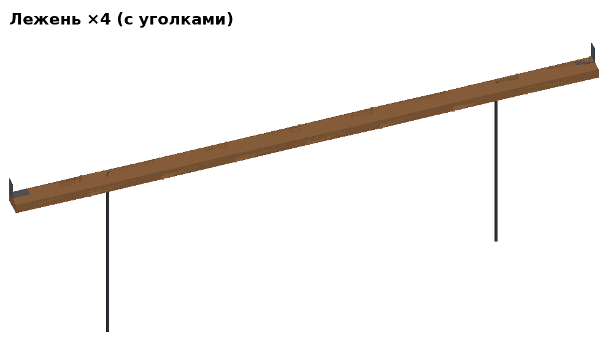

# Дом 3×3, версия 5 — инструкция


## Как собирается дом — коротко

1. В мастерской сколачиваем **щиты** (12 шт.) и **полуфермы** (6 шт.).
2. Щиты стягиваем болтами по три — получаем **пролёты** (4 стены).
3. На площадке собираем **каркас**: 4 угловые стойки, между ними внизу —
   лежни, вверху — верхняя обвязка. Всё на стальных уголках и болтах.
4. **Ставим пролёты** между стойками и притягиваем болтами.
5. Сверху — **фермы**, **конёк**, **прогоны**, **тент**.

Монтаж — **2 человека, ≈ 1,5 часа**. Весь крепёж — **болты М10** трёх длин
(80, 130, 150 мм) с гайками/барашками, всё из обычного строймага.
Инструмент на площадке: ключ на 17, стремянка, кувалда, уровень, рулетка.

Модель — `дом_v5_3х3.step`, отдельные блоки — `блоки/`, что купить —
[СПЕЦИФИКАЦИЯ.md](СПЕЦИФИКАЦИЯ.md).

## Словарик

| Слово | Что это |
|---|---|
| **Щит** | Рама 997 × 2400 из бруска 25×50, снаружи обшита фанерой 3 мм. Бывает глухой, с окном, с дверью. |
| **Пролёт** | Три щита, стянутые болтами, — готовая стена 2991 × 2400. |
| **Каркас** | Скелет дома: 4 угловые стойки + лежни внизу + верхняя обвязка вверху. Между стойками — проёмы под пролёты. |
| **Угловая стойка** | Брус 100×100 длиной 2560, стоит в каждом углу дома. |
| **Лежень** | Брус 50×100 длиной 2996, лежит на земле между двумя стойками. На него встаёт пролёт. |
| **Верхняя обвязка** | Такой же брус 50×100×2996, но на ребро и наверху — между верхами стоек. На неё встают фермы. Карнизная — над свесами крыши (стены A и C), фронтонная — под треугольниками крыши (B и D). |
| **Уголок** | Стальной крепёжный уголок 90×90×40 (продаётся в строймаге). Одной полкой прикручен к лежню или обвязке, другой — притягивается болтом к стойке. |
| **Ферма / полуферма** | Треугольная деревянная конструкция под крышу. Ферма = 2 полуфермы, стянутые болтом. Ферм три: две по краям (зашиты фанерой — треугольники фронтонов) и одна посередине. |
| **Конёк** | Брус 50×100 по верху ферм, вдоль всего дома. |
| **Прогон** | Рейка 25×50 поперёк ферм, на ней лежит тент. |
| **Футорка (врезная гайка)** | Втулка с резьбой М10, вкручивается в дерево; в неё вкручивается болт без гайки. Продаётся в отделе крепежа. |
| **Барашек** | Гайка с «ушками», затягивается рукой. |

```
             C (окно) — карнизная
      ■────────────────────■
      │                    │
  D   │                    │  B
(дверь)                    │ (окно)        D и B — фронтонные
      │                    │
      ■────────────────────■
             A (окно) — карнизная         ■ — угловые стойки
```

## Какой болт куда (все М10)

| Болт | Шт. | Где | Чем |
|---|---|---|---|
| М10×80 + гайка | 24 | щиты между собой в пролёте (**в мастерской**) | ключ |
| М10×130 + барашек | 8 | лежень к стойке (сквозь стойку в уголок) | рукой |
| М10×130 + барашек | 8 | верхняя обвязка к стойке (сквозь стойку в уголок) | рукой |
| М10×150 + барашек | 16 | пролёт к стойкам (сквозь стойку в край пролёта) | рукой |
| М10×80 | 8 | пролёт к верхней обвязке (изнутри снизу, в футорку) | ключ |
| М10×130 + барашек | 3 | две полуфермы в ферму | рукой |
| М10×80 | 6 | пяты ферм (в футорки стоек и карнизной обвязки) | ключ |

На каждый болт — увеличенная шайба под головку и под гайку.
**На площадке — 49 болтов**: 35 на барашках (рукой) и 14 в футорки (ключом).

---

## 1. Что везти на площадку

| Что | Шт. | Вес, кг | Размер, мм |
|---|---|---|---|
| Угловая стойка | 4 | 13 | 100×100×2560 |
| Лежень (с уголками) | 4 | 10 | 50×100×2996 |
| Верхняя обвязка карнизная (с уголками) | 2 | 8 | 50×100×2996 |
| Верхняя обвязка фронтонная (с уголками) | 2 | 8 | 50×100×2996 |
| Пролёт «окно» | 3 | 25 | 2991×2400×53 |
| Пролёт «дверь» | 1 | 34 | 2991×2400×53 |
| Полуферма средняя | 2 | 5,4 | ≈ 1980×680 |
| Полуферма фронтонная А / Б | 2 + 2 | 5,5 | ≈ 1980×680 |
| Конёк (с бобышками) | 1 | 9 | 50×100×3500 |
| Прогон | 4 | 2,2 | 25×50×3500 |
| Тент 4×5 м, 2 стяжных ремня, 8 кольев из арматуры | | | |
| Ящик: 49 болтов М10 (+10 %), 35 барашков, шайбы | | | |

Если пролёт 3 × 2,4 м не влезает в машину — везти щиты и стягивать в
пролёты на месте (+5 мин на пролёт).

**Размеры дома:** каркас 3200 × 3200, с крышей 3200 × 4060, высота до
конька 3,25 м, до потолка (низа ферм) 2,56 м. Вес ≈ 285 кг.

---

## 2. Мастерская

Правила:
* все соединения внутри щитов и полуферм — **клей ПВА D3 + саморезы**,
  они не разбираются;
* отверстия под болты — **сверло 11 мм**, под футорки — **14 мм**;
  одинаковые детали сверлить по шаблону (планка с отверстиями), чтобы
  подходили на любое место;
* на каждой детали — **маркировка** краской: что это, «верх», «наружу».

### 2.1 Щиты — 12 шт.

| Глухой ×8 | С окном ×3 | С дверью ×1 |
|---|---|---|
|  |  |  |
|  |  |  |

1. Рама: 2 стойки 25×50×2400 + 2 перемычки 25×50×947 (низ и верх).
   Брусок стоит **на ребро** — рама толщиной 50.
2. Обшивка снаружи — фанера ФК 3 мм 997×2400, клей + саморезы 3,5×25 через 150 мм.
3. Отверстия 11 мм поперёк стоек, посередине толщины:
   * во **всех** щитах в обеих стойках — на высоте **300, 1000, 1700**
     (стяжка щитов в пролёт);
   * в **глухих** ещё на **600, 700, 1800, 1900** (болты к угловым стойкам) и
     одно вертикальное отверстие в середине верхней перемычки (болт к
     верхней обвязке).

* **С окном:** ещё 2 перемычки 947 — низ на 1187,5 и 2187,5. Проём в фанере
  947 × 975.
* **С дверью:** 2 стойки 25×50×2050 (в 73,5 и 898,5 от левого края),
  перемычка 947 на высоте 2075. Проём 800 × 2050. Полотно 790 × 2040:
  рамка из бруска 25×50 + фанера 3 мм, 2 петли, ручка, шпингалет.

### 2.2 Пролёты — 4 шт.

| Пролёт с окном, снаружи | Пролёт с дверью, изнутри |
|---|---|
|  |  |

Глухой + окно (или дверь) + глухой, стойки вплотную, **3 болта М10×80 с
гайкой на каждый стык**.

### 2.3 Детали каркаса

| Угловая стойка | Лежень | Верхняя обвязка |
|---|---|---|
|  |  |  |

**Угловая стойка 100×100×2560** (4 шт., одинаковые). Две грани смотрят на
улицу (наружные), две — в дом. Сквозные отверстия 11 мм в двух направлениях,
высота — от низа стойки:

| | Направление «А» | Направление «Б» |
|---|---|---|
| Болт уголка лежня (77 от наружной грани) | 80 | 115 |
| Болты пролёта (28 от наружной грани) | 650, 1850 | 750, 1950 |
| Болт уголка обвязки (75 от наружной грани) | 2485 | 2535 |

Сверху — отверстие 14 мм глубиной 36 в 25 мм от обеих наружных граней,
вкрутить футорку (под пяту фермы). Направления «А» и «Б» подписать на
стойке: перепутать нельзя — отверстия не совпадут с уголками.

**Лежни 50×100×2996** (4 шт., одинаковые), плашмя:
* на каждом конце сверху, у внутренней кромки, прикрутить **уголок
  90×90×40** (вертикальная полка — вровень с торцом лежня);
* 2 отверстия 14 мм под колья — в 500 мм от концов, в 77 мм от наружной
  кромки.

**Верхняя обвязка 50×100×2996** (4 шт.), на ребро:
* на концах на внутренней грани — **уголки 90×90×40** (вертикальная полка
  вровень с торцом): на левом конце — внизу, на правом — вверху;
* снизу 2 футорки (в 501 и 2495 мм от левого конца, в 28 мм от наружной
  грани) — под болты пролёта;
* у **карнизных** ещё футорка сверху посередине (1498 от конца, 25 от
  наружной грани) — под пяту средней фермы.

### 2.4 Полуфермы — 6 шт.

| Средняя ×2 | Фронтонная А ×2 | Фронтонная Б ×2 |
|---|---|---|
|  |  |  |


Брусок 25×50 на ребро, все детали в одной плоскости:

| Деталь | Длина | Как стоит |
|---|---|---|
| Затяжка (низ) | 1700 | горизонтально; отверстие 11 мм сверху вниз в 1575 от конька |
| Стойка | 576 | вертикально на коньковом конце затяжки; отверстие 11 мм поперёк посередине |
| Стропило | 2025 | от верха стойки вниз через конец затяжки, свес ≈ 380 за стену |
| Подкос | 538 | из угла «затяжка–стойка» под 45° до стропила |

* Все узлы — фанерные **косынки** 9 мм на клей и саморезы: у средней — с двух
  сторон, у фронтонных — с внутренней.
* Фронтонные снаружи зашиты фанерой 3 мм (треугольник до стены). А и Б —
  зеркальные: в ферме фронтона всегда пара А + Б, фанерой наружу.
* На стропиле — 2 лапки 25×25×30 под прогоны (на 650 и 1320 от конька).

**Конёк 50×100×3500**, плашмя. Снизу — 6 бобышек 25×50×100: по две на
каждую ферму, по бокам, просвет между ними 45 мм (на 175, 1750, 3325 от
конца конька). Конёк кладётся сверху на фермы, бобышки не дают ему сползти.

---

## 3. Монтаж на площадке

### Шаг 1. Лежни — 5 мин


Разложить 4 лежня квадратом, уголками внутрь, выровнять подкладками
(плитка, обрезки доски).

### Шаг 2. Угловые стойки — 15 мин


В каждый угол — стойку, между концами двух лежней. Два болта **М10×130**
снаружи сквозь стойку в уголки лежней, изнутри — барашки. Проверить
**диагонали** (около 4525 мм) и забить 8 кольев из арматуры в отверстия
лежней.

### Шаг 3. Верхняя обвязка — 12 мин


Со стремянки: обвязку — между верхами стоек, вровень с их верхом. Болт
**М10×130** снаружи сквозь стойку в уголок обвязки, барашек — по одному на
каждый конец. Карнизные — над стенами A и C, фронтонные — над B и D.
Каркас готов.

### Шаг 4–5. Пролёты — 20 мин

| Как ставится пролёт | Все пролёты на месте |
|---|---|
|  |  |

Каждый пролёт вдвоём:
1. Поставить на лежень между стойками, фанерой наружу (можно заводить и
   снаружи, и изнутри — до обвязки остаётся 10 мм).
2. **4 болта М10×150** снаружи сквозь стойки в крайние стойки пролёта,
   изнутри — барашки.
3. **2 болта М10×80** изнутри снизу вверх сквозь верхнюю перемычку пролёта
   в футорки верхней обвязки.

Пролёт с дверью — в стену D, с окнами — в A, B, C.

### Шаг 6. Фермы — 15 мин


1. На земле сложить полуфермы парами стойка к стойке и стянуть болтом
   М10×130 с барашком: фронтон D = А + Б, середина = 2 средние, фронтон
   B = Б + А (фанерой наружу).
2. Поднять ферму (≈ 12 кг) на обвязку и закрепить пяты болтами **М10×80**
   сквозь затяжку в футорки: у крайних ферм — в верх угловых стоек, у
   средней — в середину карнизных обвязок.

### Шаг 7. Конёк и прогоны — 7 мин


Конёк положить на верх ферм (бобышки по бокам ферм). 4 прогона — в лапки
на стропилах. Ничего не крепится — держит тент и ремни.

### Шаг 8. Тент — 10 мин


Тент — через конёк, края привязать к люверсам/лежням. Поверх — 2 стяжных
ремня через всю крышу, концы — под лежни A и C, затянуть храповиком.

| Этап | Мин |
|---|---|
| Раскладка | 10 |
| Лежни | 5 |
| Стойки, колья | 15 |
| Верхняя обвязка | 12 |
| Пролёты | 20 |
| Фермы | 15 |
| Конёк, прогоны | 7 |
| Тент, ремни | 10 |
| **Итого** | **≈ 95** |

## 4. Разборка — ≈ 45 мин

В обратном порядке: ремни, тент → прогоны, конёк → болты пят, фермы вниз,
разобрать на полуфермы → болты пролётов, пролёты → обвязка → колья,
стойки → лежни.

---

## 5. Что проверить при осмотре

* **Щит 997 мм** — чтобы пролёт (2991) встал между стойками (3000) с
  зазором 4,5 мм с каждой стороны; лежни и обвязка 2996 — зазор 2 мм.
* Каркас становится жёстким, когда стоят пролёты (фанера). До этого стойки
  держат уголки — их лучше придерживать, пока ставится обвязка.
* **Фанера ФК 3 мм** на щитах делает дом жёстким без диагоналей (~52 кг на
  весь дом). Тоньше 3 мм не стоит: саморезы продавливают лист, он выпучивается
  и пробивается. Если вместо фанеры ткань/баннер — в щиты нужны диагонали.
* **Тент** вместо жёсткой кровли — быстро и не течёт.
* **Пола нет**: при желании щиты пола кладутся на лежни изнутри.
