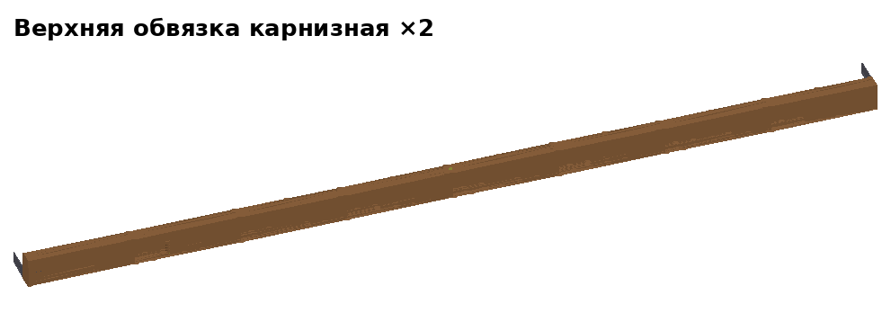
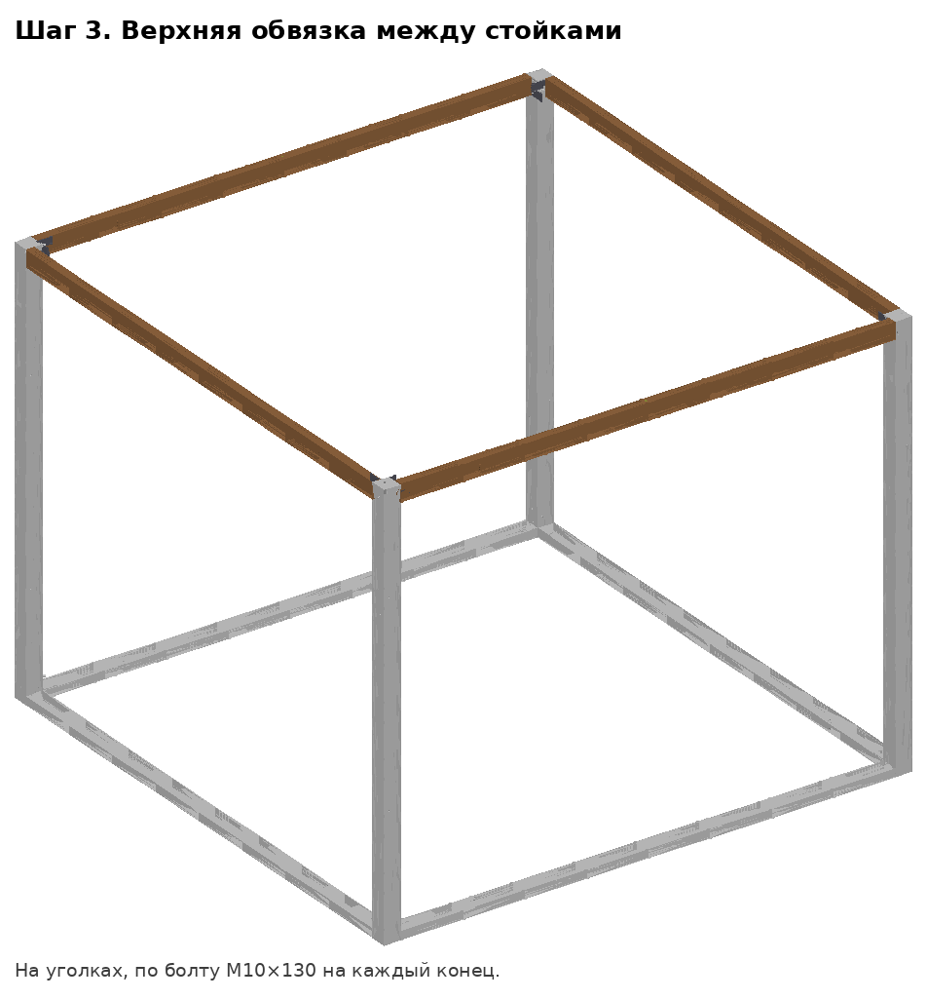

# Дом 3×3, версия 5 — инструкция


## Как собирается дом — коротко

1. В мастерской сколачиваем **щиты** (12 шт.) и **полуфермы** (6 шт.).
2. Щиты стягиваем болтами по три — получаем **пролёты** (4 стены).
3. На площадке собираем **каркас**: лежни на земле → 4 угловые стойки →
   верхняя обвязка.
4. **Вставляем пролёты** в каркас и притягиваем болтами к стойкам.
5. Сверху — **фермы**, **конёк**, **прогоны**, **тент**.

Монтаж — **2 человека, ≈ 1,5 часа**. Весь крепёж — **болты М10** разной длины
(и гайки/барашки к ним), всё из обычного строймага. Инструмент на площадке:
ключ на 17, стремянка, кувалда, уровень, рулетка.

Модель — `дом_v5_3х3.step`, отдельные блоки — `блоки/`, что купить —
[СПЕЦИФИКАЦИЯ.md](СПЕЦИФИКАЦИЯ.md).

## Словарик

| Слово | Что это |
|---|---|
| **Щит** | Рама 997 × 2400 из бруска 25×50, снаружи обшита фанерой 4 мм. Бывает глухой, с окном, с дверью. |
| **Пролёт** | Три щита, стянутые болтами, — готовая стена 2991 × 2400. |
| **Каркас** | Скелет дома: лежни + 4 угловые стойки + верхняя обвязка. В его проёмы вставляются пролёты. |
| **Лежень** | Доска 50×150 длиной 3,2 м, лежит на земле по периметру. На лежни встают стойки и пролёты. |
| **Угловая стойка** | Брус 100×100, стоит в каждом углу дома. |
| **Верхняя обвязка** | Брус 50×100 длиной 3,2 м, лежит сверху на стойках, связывает их. На неё встают фермы. Карнизная — над длинными свесами крыши (стены A и C), фронтонная — под треугольниками крыши (B и D). |
| **Упорная рейка** | Рейка 25×25 на стойке, лежне и обвязке с внутренней стороны проёма. Пролёт вставляется снаружи и упирается в эти рейки — внутрь не провалится. |
| **Нахлёст (вполдерева)** | Соединение в углу: у обеих досок на концах выбрано по половине толщины, концы кладутся друг на друга. |
| **Ферма / полуферма** | Треугольная деревянная конструкция под крышу. Ферма = 2 полуфермы, стянутые болтом. Фермы три: две по краям (зашиты фанерой — это треугольники фронтонов), одна посередине. |
| **Конёк** | Брус 50×100 по верху ферм, вдоль всего дома. |
| **Прогон** | Длинная рейка 25×50 поперёк ферм, на ней лежит тент. |
| **Футорка (врезная гайка)** | Втулка с резьбой М10, вкручивается в дерево. В неё вкручивается болт без гайки. Продаётся в строймаге в отделе крепежа. |
| **Опора бруса** | П-образный оцинкованный держатель 100×100 (дно + две «щеки»), продаётся рядом с крепёжными уголками. В него ставится низ стойки. |
| **Барашек** | Гайка с «ушками», затягивается рукой. |

```
             C (окно) — карнизная
      ┌■──────────────────■┐
      │                    │
  D   │                    │  B
(дверь)                    │ (окно)        D и B — фронтонные
      │                    │
      └■──────────────────■┘
             A (окно) — карнизная         ■ — угловые стойки
```

## Какой болт куда (все М10)

| Болт | Шт. | Где | Чем затягивать |
|---|---|---|---|
| М10×70 + гайка | 24 | щиты между собой в пролёте (в мастерской) | ключ |
| М10×50 | 4 | углы лежней (в футорку нижнего лежня) | ключ |
| М10×130 + барашек | 4 | стойка в опоре бруса | рукой |
| М10×150 + барашек | 16 | пролёт к стойкам (4 на пролёт) | рукой |
| М10×130 + барашек | 3 | две полуфермы в ферму | рукой |
| М10×180 | 4 | угол: пята крайней фермы + две обвязки → в футорку стойки | ключ |
| М10×80 | 2 | пята средней фермы → в футорку карнизной обвязки | ключ |

На каждый болт — увеличенная шайба под головку и под гайку.
**На площадке — 33 болта**, из них 23 на барашках (рукой) и 10 в футорки (ключом).

---

## 1. Что везти на площадку

| Что | Шт. | Вес, кг | Размер, мм |
|---|---|---|---|
| Лежень X (с футорками) | 2 | 15 | 50×150×3200 |
| Лежень Y (с опорами бруса) | 2 | 12 | 50×150×3200 |
| Угловая стойка | 4 | 14 | 100×100×2408 |
| Верхняя обвязка карнизная | 2 | 10 | 50×100×3200 |
| Верхняя обвязка фронтонная | 2 | 10 | 50×100×3200 |
| Пролёт «окно» | 3 | 29 | 2991×2400×54 |
| Пролёт «дверь» | 1 | 38 | 2991×2400×54 |
| Полуферма средняя | 2 | 5,4 | ≈ 1980×680 |
| Полуферма фронтонная А / Б | 2 + 2 | 5,9 | ≈ 1980×680 |
| Конёк (с бобышками) | 1 | 9 | 50×100×3500 |
| Прогон | 4 | 2,2 | 25×50×3500 |
| Тент 4×5 м, 2 стяжных ремня, 6 кольев из арматуры | | | |
| Ящик: 33 болта М10 (+10% запас), 23 барашка, шайбы | | | |

Если пролёт 3 × 2,4 м не влезает в машину — везти щиты по отдельности и
стягивать в пролёты на месте (+5 мин на пролёт).

**Размеры дома:** каркас 3200 × 3200, с крышей 3200 × 4060, высота до
конька 3,25 м, до потолка (низа ферм) 2,56 м. Вес ≈ 330 кг.

---

## 2. Мастерская

Правила:
* все соединения внутри щитов и полуферм — **клей ПВА D3 + саморезы**,
  они не разбираются;
* отверстия под болты — **сверло 11 мм**, под футорки — **14 мм**;
  одинаковые детали сверлить по шаблону (планка с отверстиями), чтобы
  подходили к любому месту;
* на каждой детали — **маркировка** краской: что это, «верх», «наружу»,
  буква стены.

### 2.1 Щиты — 12 шт.

| Глухой ×8 | С окном ×3 | С дверью ×1 |
|---|---|---|
|  |  |  |
|  |  |  |

1. Рама: 2 стойки 25×50×2400 + 2 перемычки 25×50×947 (низ и верх).
   Брусок стоит **на ребро** — рама толщиной 50.
2. Обшивка снаружи — фанера 4 мм 997×2400, клей + саморезы 3,5×25 через 150 мм.
3. Отверстия 11 мм поперёк стоек, посередине толщины:
   * во **всех** щитах в обеих стойках — на высоте **300, 1000, 1700**
     (стяжка щитов в пролёт);
   * в **глухих** ещё на **600, 700, 1800, 1900** (крепление пролёта к угловым
     стойкам).

* **С окном:** ещё 2 перемычки 947 — низ на 1187,5 и 2187,5. Проём в фанере
  947 × 975.
* **С дверью:** 2 стойки 25×50×2050 (в 73,5 и 898,5 от левого края),
  перемычка 947 на высоте 2075. Проём 800 × 2050. Полотно 790 × 2040:
  рамка из бруска 25×50 + фанера 4 мм, 2 петли, ручка, шпингалет.

### 2.2 Пролёты — 4 шт.

| Пролёт с окном, снаружи | Пролёт с дверью, изнутри |
|---|---|
|  |  |

Глухой + окно (или дверь) + глухой, стойки вплотную, **3 болта М10×70 с
гайкой на каждый стык**.

### 2.3 Детали каркаса

| Угловая стойка | Верхняя обвязка | Лежень Y |
|---|---|---|
|  |  |  |

**Угловая стойка 100×100×2408** (4 шт., все одинаковые). Две грани —
наружные (смотрят на улицу), две — внутренние.
* Внизу: сквозное отверстие 11 мм на высоте 75, в 23 мм от одной внутренней
  грани — под болт опоры.
* Отверстия 11 мм под болты пролётов, в 29 мм от наружной грани: в одну
  сторону — на 598 и 1798 от низа, в другую — на 698 и 1898.
* Сверху: отверстие 14 мм глубиной 35 в 25 мм от обеих наружных граней,
  вкрутить футорку.
* На внутренних гранях — упорные рейки 25×25×2223 (от 155 до 2378 от низа),
  в 54 мм от наружной грани.

**Лежни 50×150×3200** (4 шт.):
* на концах — нахлёст: выбрать 150×150 на половину толщины (25 мм); у
  лежней X — сверху, у Y — снизу;
* в нахлёсте в 125 мм от конца и от наружной кромки: у X — отверстие 14 мм и
  футорка, у Y — сквозное 11 мм;
* сверху упорная рейка 25×25×2900 (от 150 до 3050), в 54 мм от наружной
  кромки;
* у лежней X — отверстия 14 мм под колья: на 300, 1600, 2900, в 115 мм от
  наружной кромки;
* у лежней Y — на концах сверху прикрутить **опоры бруса 100×100**
  (вплотную к наружным кромкам).

**Верхняя обвязка 50×100×3200** (4 шт.), брус на ребро:
* на концах — нахлёст 50×50 на половину высоты (у карнизных — сверху, у
  фронтонных — снизу), в нём сквозное 11 мм (в 25 мм от конца и кромки);
* снизу с внутренней стороны — Г-образная упорная рейка 3000 (от 100 до
  3100);
* у **карнизных** посередине (1600) сверху — отверстие 14 мм и футорка.

### 2.4 Полуфермы — 6 шт.

| Средняя ×2 | Фронтонная А ×2 | Фронтонная Б ×2 |
|---|---|---|
|  |  |  |


Брусок 25×50 на ребро, все детали в одной плоскости:

| Деталь | Длина | Как стоит |
|---|---|---|
| Затяжка (низ) | 1700 | горизонтально; отверстие 11 мм сверху вниз в 1575 от конька |
| Стойка | 576 | вертикально на коньковом конце затяжки; отверстие 11 мм поперёк посередине |
| Стропило | 2025 | от верха стойки вниз через конец затяжки, свес ≈ 380 за стену |
| Подкос | 538 | из угла «затяжка–стойка» под 45° до стропила |

* Все узлы — фанерные **косынки** 9 мм на клей и саморезы: у средней — с двух
  сторон, у фронтонных — с внутренней.
* Фронтонные снаружи зашиты фанерой 4 мм (треугольник до стены). А и Б —
  зеркальные: в ферме фронтона всегда пара А + Б, фанерой наружу.
* На стропиле — 2 лапки 25×25×30 под прогоны (на 650 и 1320 от конька).

**Конёк 50×100×3500**, плашмя. Снизу — 6 бобышек 25×50×100: по две на
каждую ферму, по бокам, просвет между ними 45 мм (на 175, 1750, 3325 от
конца конька). Конёк кладётся сверху на фермы, бобышки не дают ему сползти.

---

## 3. Монтаж на площадке

### Шаг 1. Основание — 20 мин


1. Лежни X — на землю, нахлёстом вверх. На их концы — лежни Y (с опорами
   бруса), нахлёстом вниз.
2. В углах — болт М10×50 сверху в футорку.
3. Выровнять подкладками (плитка, обрезки доски). **Диагонали равны** —
   около 4525 мм.
4. Забить 6 кольев из арматуры в отверстия лежней X.

### Шаг 2. Угловые стойки — 5 мин


Стойку — в опору бруса, упорными рейками внутрь дома. Болт М10×130 через
опору и стойку, барашек. Стойка стоит сама.

### Шаг 3. Верхняя обвязка — 10 мин



Со стремянки: сначала 2 **карнизные** (A, C), нахлёстом вверх, потом 2
**фронтонные** (B, D), нахлёстом вниз. Концы ложатся на стойки, отверстия в
нахлёстах совпадают с футоркой в стойке. Болты в углах ставятся на шаге 6 —
вместе с фермами.

### Шаг 4–5. Пролёты — 20 мин

| Как вставить пролёт | Все пролёты на месте |
|---|---|
|  |  |

Каждый пролёт вдвоём:
1. Поставить низом на лежень **снаружи** дома, фанерой наружу.
2. Наклонить в проём, пока не упрётся в упорные рейки (снизу, по бокам,
   сверху). Внутрь он не провалится — его держат рейки.
3. С улицы через угловые стойки — **4 болта М10×150**, изнутри дома —
   барашки. Теперь пролёт не вывалится и наружу.

Пролёт с дверью — в стену D, с окнами — в A, B, C.

### Шаг 6. Фермы — 15 мин


1. На земле сложить полуфермы парами стойка к стойке и стянуть болтом
   М10×130 с барашком: фронтон D = А + Б, середина = 2 средние, фронтон
   B = Б + А (фанерой наружу).
2. Поднять ферму (≈ 12 кг) на обвязку:
   * крайние фермы — над стенами D и B; отверстие в затяжке совпадает с
     отверстием в углу обвязки; болт **М10×180** сквозь затяжку и обе
     обвязки — в футорку стойки;
   * средняя — посередине; болт **М10×80** сквозь затяжку в футорку
     карнизной обвязки.

### Шаг 7. Конёк и прогоны — 7 мин


Конёк положить на верх ферм (бобышки по бокам ферм). 4 прогона — в лапки
на стропилах. Ничего не крепится — держит тент и ремни.

### Шаг 8. Тент — 10 мин


Тент — через конёк, края привязать к люверсам/лежням. Поверх — 2 стяжных
ремня через всю крышу, концы — под лежни A и C, затянуть храповиком.

| Этап | Мин |
|---|---|
| Раскладка | 10 |
| Основание + колья | 20 |
| Стойки | 5 |
| Верхняя обвязка | 10 |
| Пролёты | 20 |
| Фермы | 15 |
| Конёк, прогоны | 7 |
| Тент, ремни | 10 |
| **Итого** | **≈ 100** |

## 4. Разборка — ≈ 45 мин

В обратном порядке: ремни, тент → прогоны, конёк → болты ферм, фермы вниз,
разобрать на полуфермы → барашки пролётов, пролёты наружу → обвязка →
стойки → колья, лежни.

---

## 5. Что проверить при осмотре

* **Щит 997 мм** — чтобы пролёт (2991) входил в проём каркаса (3000) с зазором
  4,5 мм с каждой стороны.
* **Фанера 4 мм** на щитах делает дом жёстким без диагоналей, но весит
  ~70 кг на весь дом. Если вместо неё ткань/баннер — в щиты нужны диагонали.
* **Тент** вместо жёсткой кровли — быстро и не течёт.
* **Пола нет**: при желании щиты пола кладутся на лежни изнутри.
