# Дом 3×3, версия 5 — каркас + пролёты стен

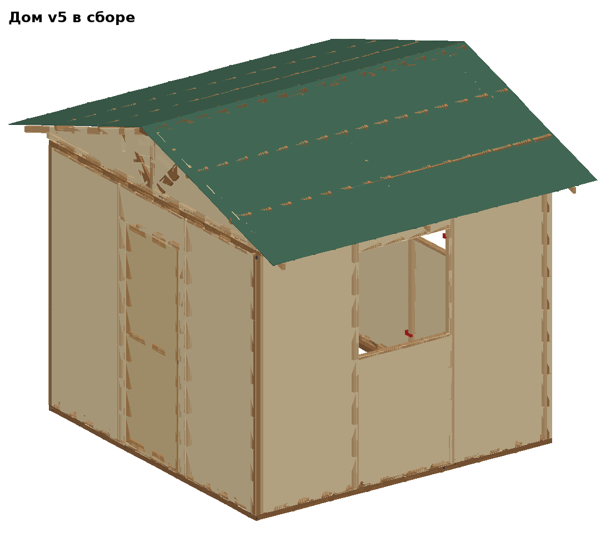

**Логика сборки:**

1. **Щиты** — в мастерской, неразборные: 8 глухих, 3 «окно», 1 «дверь».
2. **Пролёты стен** — по 3 щита на болтах: 3 пролёта «окно» и 1 «дверь».
3. **Каркас дома** — на площадке: лежни → 4 угловые стойки → 4 ригеля.
4. **Пролёты вставляются в проёмы каркаса** снаружи и запираются вертушками.
5. **Сверху** — 3 фермы (по 2 полуфермы), конёк, прогоны, тент.

Монтаж — **2 человека, ≈ 1,5 часа** (с опытом — 75–85 мин).

Модель: `дом_v5_3х3.step`, блоки — `блоки/*.step`, закупка —
[СПЕЦИФИКАЦИЯ.md](СПЕЦИФИКАЦИЯ.md). Всё генерируется скриптами
`tools/v5_house.py` (модель, спецификация) и `tools/v5_draw.py` (картинки);
размеры меняются в начале скрипта.

| | |
|---|---|
| Каркас (по стойкам) | 3200 × 3200 мм |
| С карнизными свесами | 3200 × 4060 (тент 3550 × 4060) |
| Высота: до затяжек / до конька | 2560 / 3236 мм |
| Проём каркаса / пролёт | 3000 × 2410 / 2991 × 2400 × 54 |
| Уклон кровли | 17,6° |
| Масса без тента | ≈ 337 кг |
| Самое тяжёлое место | пролёт «дверь», 38 кг (вдвоём) |

---

## 1. Комплект на площадку

| Место | Шт. | Масса, кг | Размер, мм |
|---|---|---|---|
| Лежень X (с анкерными скобами) | 2 | 11,6 | 50×100×3200 |
| Лежень Y (со стаканами стоек) | 2 | 10,6 | 50×100×3200 |
| Угловая стойка | 4 | 13,6 | 100×100×2410 |
| Ригель карнизный | 2 | 10,2 | 50×100×3200 |
| Ригель фронтонный | 2 | 10,1 | 50×100×3200 |
| Пролёт «окно» | 3 | 28,9 | 2991×2400×54 |
| Пролёт «дверь» | 1 | 38,0 | 2991×2400×54 |
| Полуферма средняя | 2 | 5,5 | ≈ 1980×680 |
| Полуферма фронтонная А / Б | 2 + 2 | 6,0 | ≈ 1980×680 |
| Конёк | 1 | 8,7 | 50×100×3500 |
| Прогон | 4 | 2,2 | 25×50×3500 |
| Тент с люверсами | 1 | | ≈ 3,6 × 4,2 м |
| Ящик: 3 болта M8 с барашками, 6 R-шплинтов, 6 анкеров, 4 растяжки | 1 | | |

**27 мест + тент + ящик.** Если пролёты не влезают в транспорт — везти
щитами (12 шт. до 18 кг) и стягивать в пролёты на площадке (+5 мин на пролёт).

Стены (вид сверху): A и C — **карнизные** (над ними свесы), B и D —
**фронтонные** (над ними крайние фермы). Дверь — в стене D.

```
             C (окно)
      ┌■──────────────────■┐
      │                    │
  D   │                    │  B
(дверь)                    │ (окно)
      │                    │
      └■──────────────────■┘
             A (окно)          ■ — угловые стойки
```

---

## 2. Мастерская

Общие правила:
* узлы щитов, ферм, реек — **клей ПВА D3 + саморезы**, блоки не разбираются;
* отверстия сверлить **по кондуктору**, чтобы одинаковые блоки были взаимозаменяемы;
* штыри Ø12 — стальной пруток на эпоксидке; приёмные отверстия Ø13; у штырей
  под R-шплинт — поперечное отверстие Ø4 в 12 мм от верха;
* **маркировка** краской на каждом блоке: тип, номер, «верх», «наружу»;
  на лежнях и ригелях — буква стены.

### 2.1 Щиты (12 шт.)

| Глухой ×8 | «Окно» ×3 | «Дверь» ×1 |
|---|---|---|
| 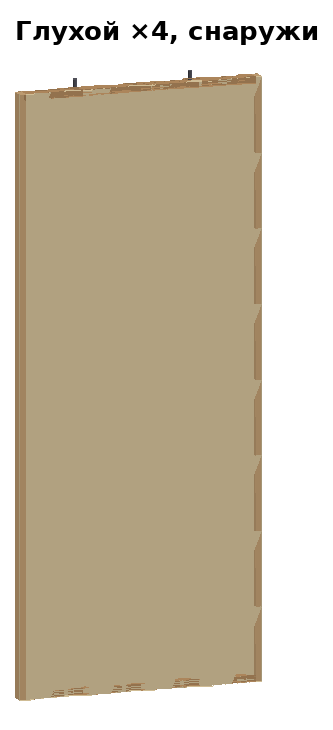 | 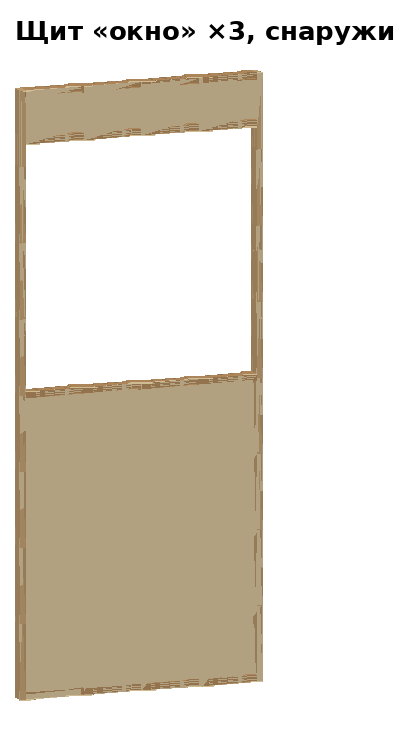 | 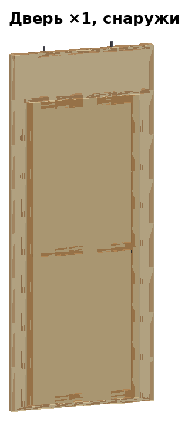 |
| 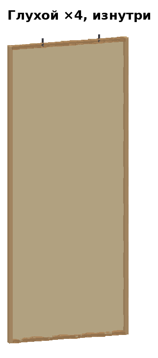 | 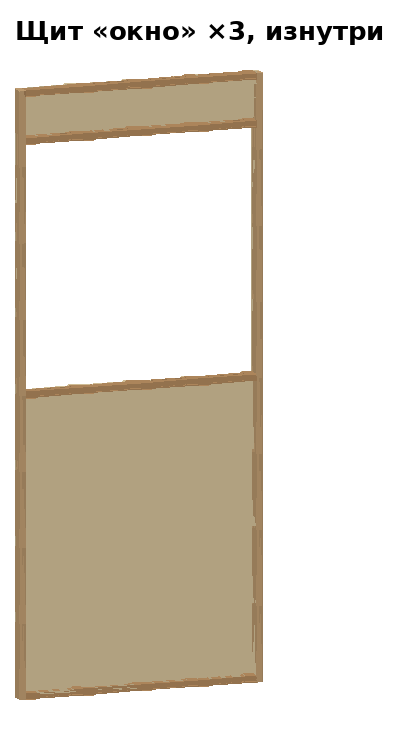 | 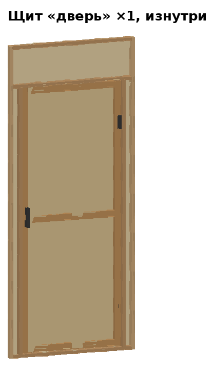 |

Рама **997 × 2400**, брус 25×50 на ребро:
1. 2 стойки 2400 + 2 перемычки 947 (низ, верх).
2. В **обеих стойках** — отверстия Ø9 поперёк, по центру глубины, на высоте
   300, 1000, 1700 (болты стяжки в пролёт).
3. Снаружи — фанера 4 мм на клей и саморезы 3,5×25 шаг 150 (жёсткость щита,
   диагонали не нужны).

Отличия:
* **«Окно»:** ещё 2 перемычки 947 (низ на 1187,5 и 2187,5). Вырез в обшивке —
  проём **947 × 975**.
* **«Дверь»:** стойки 25×50×2050 в 73,5 и 898,5 от левого края, перемычка
  947 на 2075–2100. Проём **800 × 2050**, порог 25. Полотно 790 × 2040:
  рамка 25×50 плашмя + фанера 4 мм, 2 петли, ручка, завёртка.

### 2.2 Пролёты (4 шт.)

| Пролёт «окно», снаружи | Пролёт «дверь», изнутри |
|---|---|
| 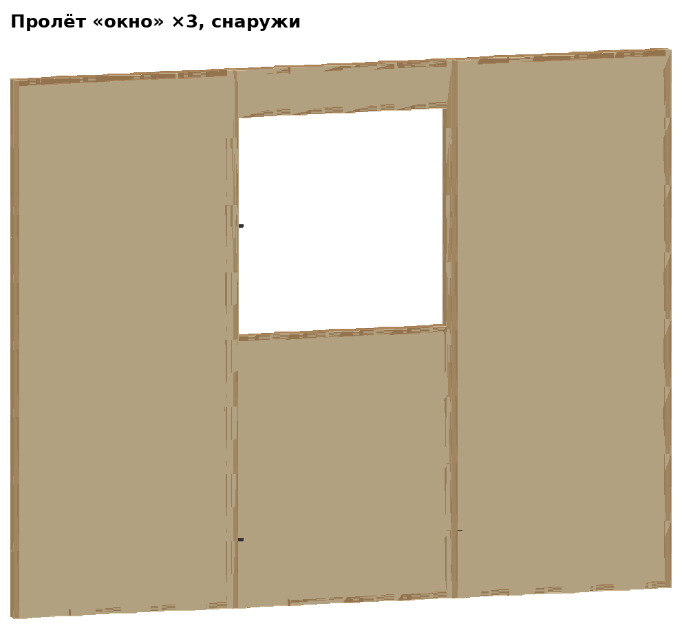 | 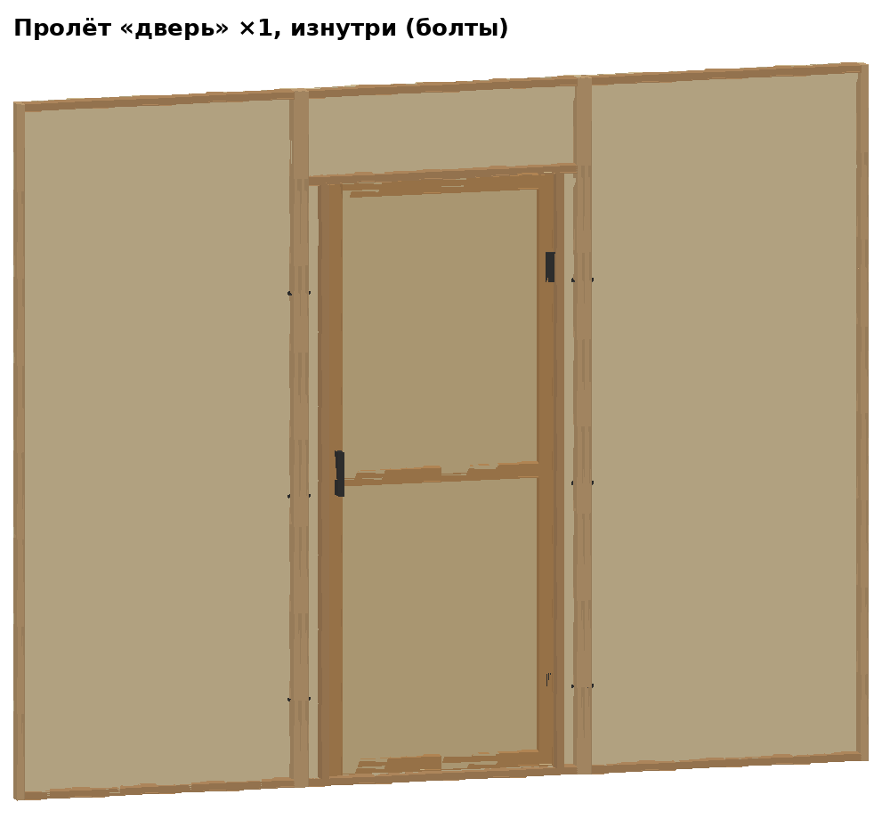 |

Глухой + «окно» (или «дверь») + глухой, стойки вплотную, **3 болта M8×75 на
стык** (6 на пролёт). Пролёт 2991 × 2400 — в проёме каркаса 3000 остаётся
4,5 мм с каждой стороны.

### 2.3 Каркас

| Угловая стойка | Ригель карнизный | Лежень Y |
|---|---|---|
| 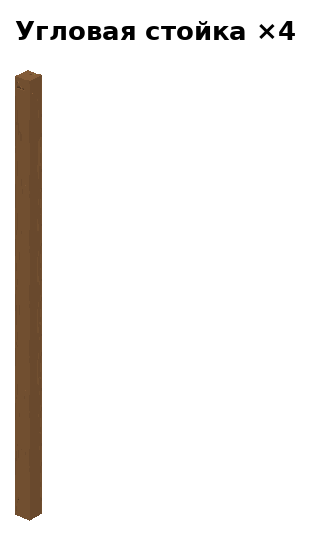 | 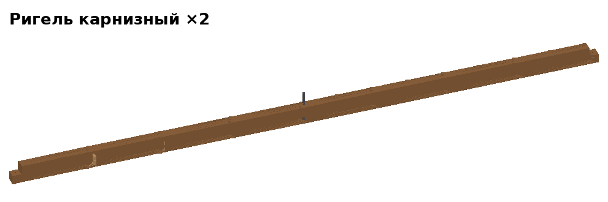 | 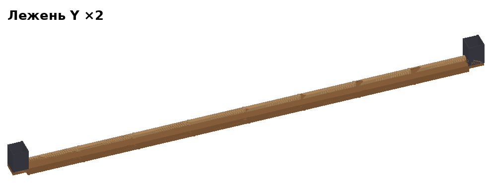 |

* **Угловая стойка 100×100×2410** (4 шт., одинаковые): снизу по центру —
  отверстие Ø13 глубиной 45; сверху в 25 мм от обеих наружных граней вклеен
  штырь Ø12×215 (торчит на 175: два ригеля + пята фермы + R-шплинт). На двух
  внутренних гранях — **упорные рейки 25×25×2180** (от 200 до 2380 от низа),
  в 54 мм от наружной грани.
* **Лежни 50×100×3200**: по концам выборка вполдерева 100×100×25 (у X —
  сверху, у Y — снизу). Упорная рейка 25×25×2996 сверху, в 54 мм от наружной
  кромки. **Лежни X:** в углах вклеены штыри Ø12×85 (в 50 мм от конца и
  кромки), 3 анкерные скобы (на 300, 1600, 2900). **Лежни Y:** в углах
  отверстия Ø13 и стальные **стаканы 100×100×150** под стойки.
* **Ригели 50×100×3200** на ребро: по концам выборка 50×50×50 (карнизные —
  сверху, фронтонные — снизу), в углах отверстия Ø13 (25 от конца и кромки).
  На внутренней грани снизу — Г-образная упорная рейка 3000 (верх пролёта).
  **Карнизные:** в середине вклеен штырь Ø12×165 (торчит на 75) под пяту
  средней фермы.

### 2.4 Полуфермы (6 шт.)

| Средняя | Фронтонная А | Фронтонная Б |
|---|---|---|
| 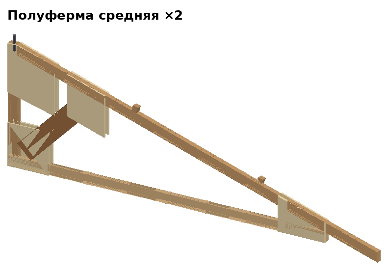 | 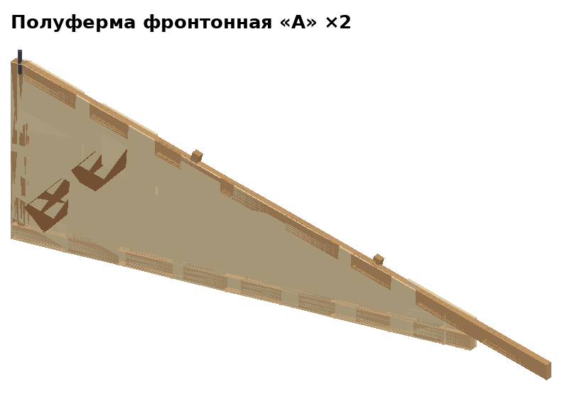 | 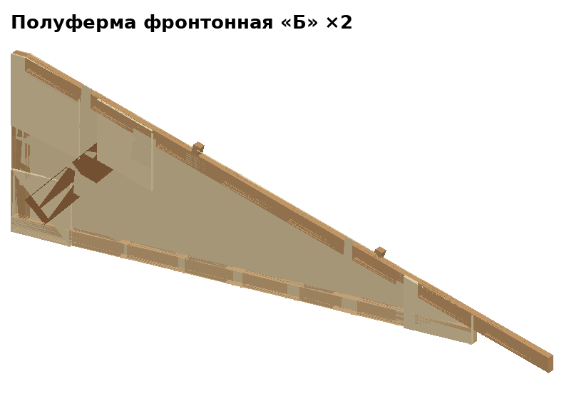 |

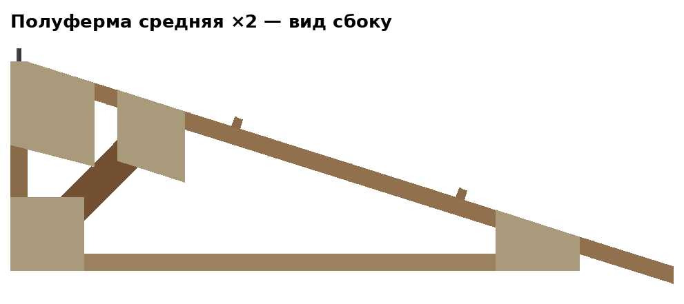

Брус 25×50 **на ребро**, всё в одной плоскости:

| Деталь | Длина | |
|---|---|---|
| Затяжка | 1700 | вертикальное Ø13 в 1575 от конькового конца (пята) |
| Стойка | 576 | на коньковом конце затяжки; горизонтальное Ø9 посередине (болт пары); сверху штырь Ø12×80 (в конёк) |
| Стропило | 2025 | верх — вертикальный рез в стойку, низ — вертикальный рез (свес ≈ 380 от стены) |
| Подкос | 538 | низ — клин 45°/45° в угол затяжка/стойка, верх — по стропилу |

* Косынки — фанера 9 мм: вершина, пята, низ и верх подкоса. У средней — с
  двух сторон, у фронтонных — изнутри.
* Фронтонные: снаружи фанера 4 мм на весь треугольник (до 1604 от конька).
  А и Б зеркальны — в ферме фронтона пара А + Б, обшивкой наружу.
* Лапки 25×25×30 на стропиле под прогоны: на 650 и 1320 от конька.

Конёк 50×100×3500 плашмя: снизу 6 глухих Ø13 (по 2 на ферму, ±25 от оси, на
175 / 1750 / 3325 от конца). Прогоны 25×50×3500 — без обработки.

---

## 3. Монтаж (2 человека)

Инструмент: стремянка, вороток для анкеров, уровень, рулетка.

### Шаг 1. Основание — 15 мин

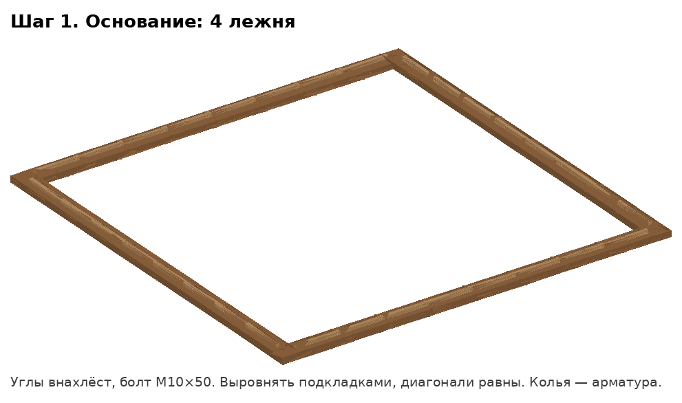

Лежни X выборкой вверх, на них лежни Y (со стаканами), углы — на штыри.
Выровнять подкладками, **диагонали равны** (≈ 4525).

### Шаг 2. Анкеры — 10 мин

6 анкеров-штопоров через скобы лежней X.

### Шаг 3. Угловые стойки — 5 мин

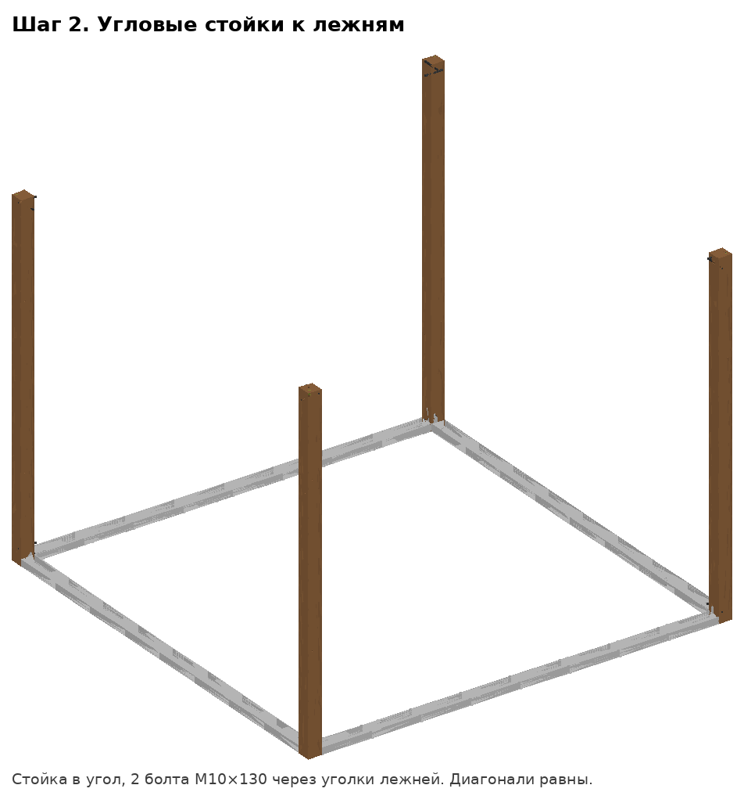

Стойку — в стакан на угловой штырь, рейками внутрь. Стоит сама.

### Шаг 4. Ригели — 10 мин

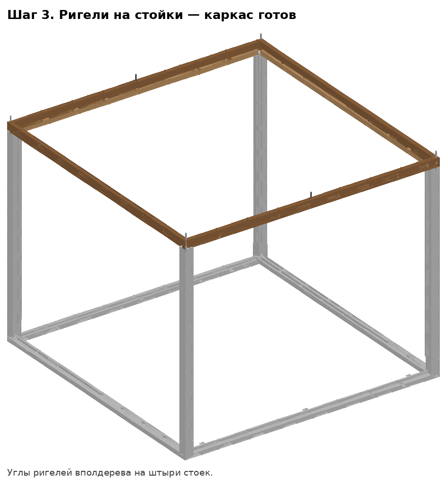

Сначала 2 **карнизных** (A, C) выборкой вверх, потом 2 **фронтонных**
(B, D) выборкой вниз; углы — на штыри стоек. **Каркас готов** и жёсткий
в углах за счёт нахлёста.

### Шаг 5. Пролёты — 20 мин

| Вставка пролёта | Все пролёты |
|---|---|
| 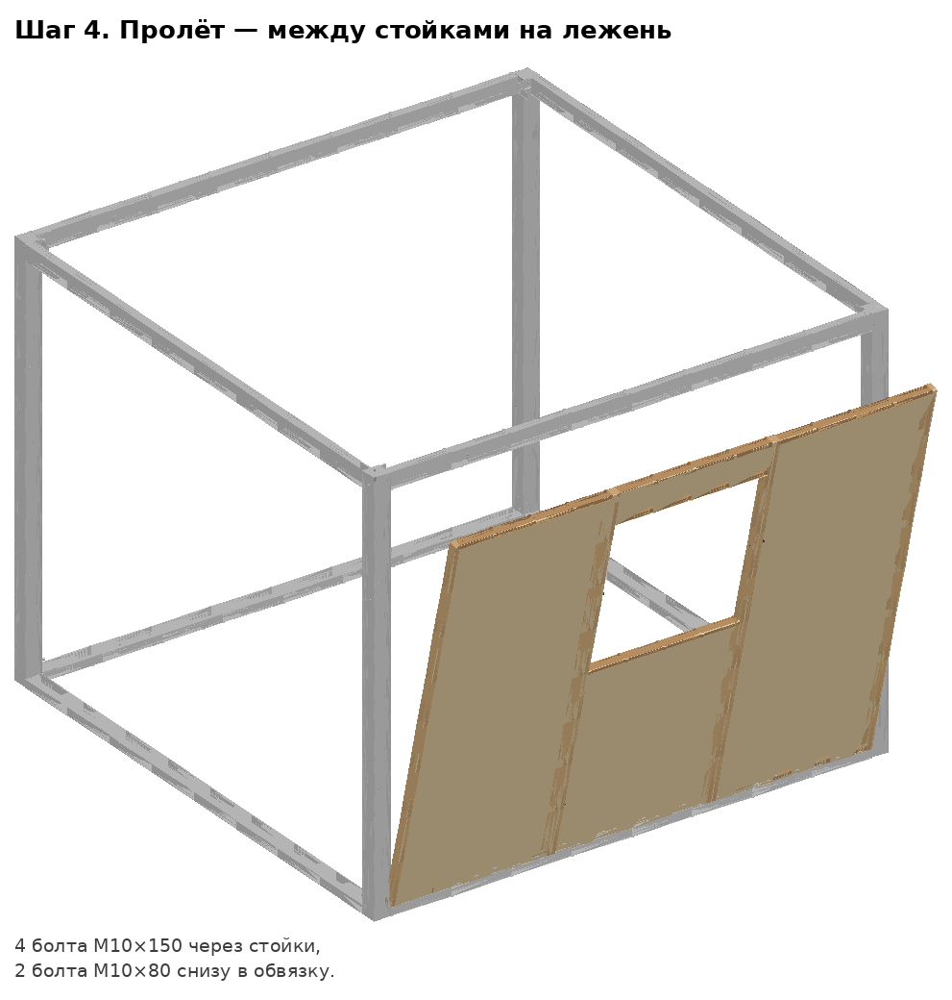 | 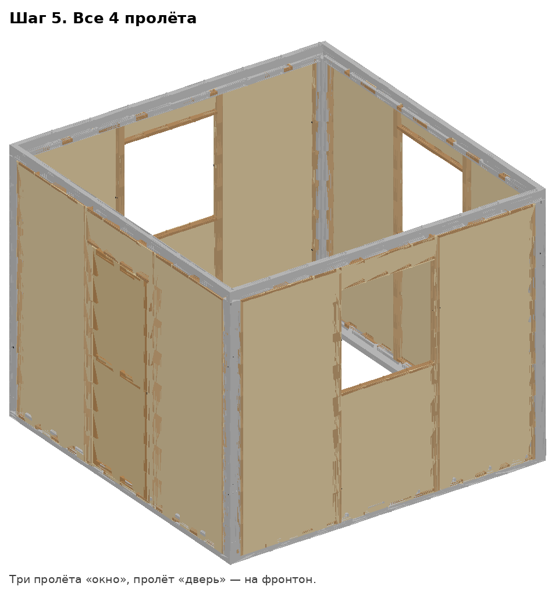 |

Каждый пролёт (вдвоём, за края):
1. Поставить низом на лежень **снаружи** каркаса, обшивкой наружу.
2. Наклонить в проём до упора в рейки (снизу, по бокам, сверху).
3. Закрыть **8 вертушек** снаружи: 2 на каждой стойке, 2 на ригеле,
   2 на лежне.

Пролёт «дверь» — в стену D, три «окна» — в A, B, C. Ветер давит пролёт на
упорные рейки, вертушки держат только от отсоса.

### Шаг 6. Фермы — 15 мин

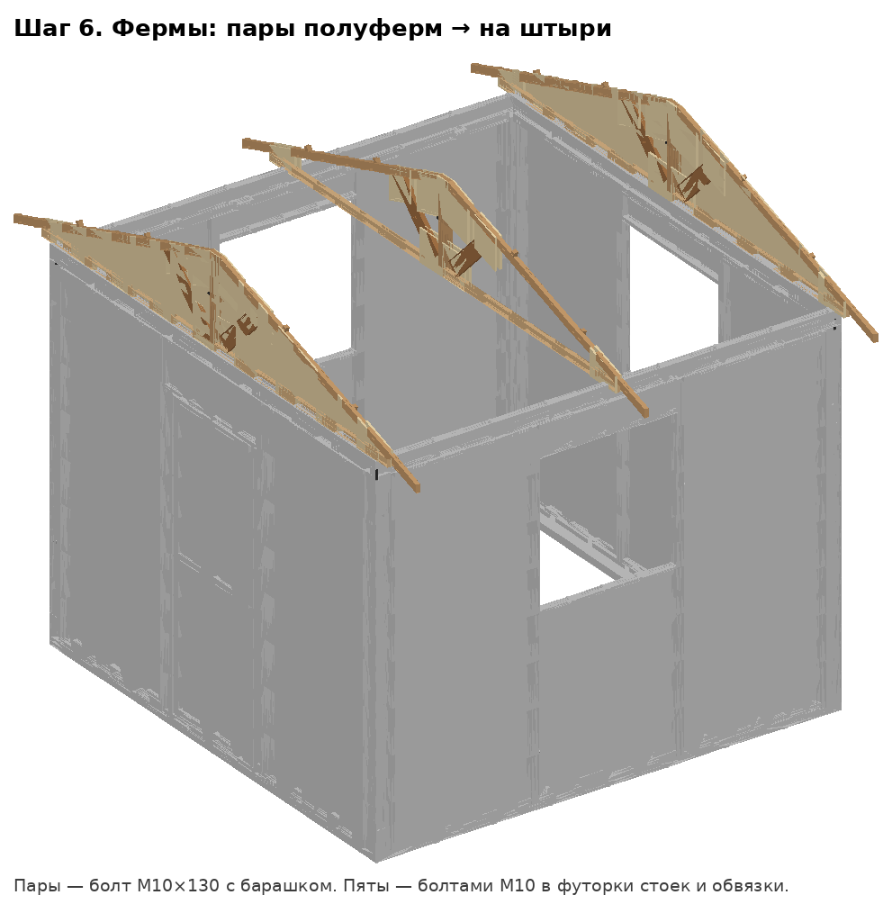

1. На земле — пары полуферм стойка к стойке, **болт с барашком**. Фронтон D:
   А + Б, середина: 2 средние, фронтон B: Б + А (обшивкой наружу).
2. Поднять (12 кг), пятами — на штыри: крайние — на штыри угловых стоек
   (сквозь ригели), средняя — на штыри карнизных ригелей.
3. На каждую пяту — **R-шплинт** сбоку (держит от отрыва ветром).

### Шаг 7. Конёк и прогоны — 7 мин

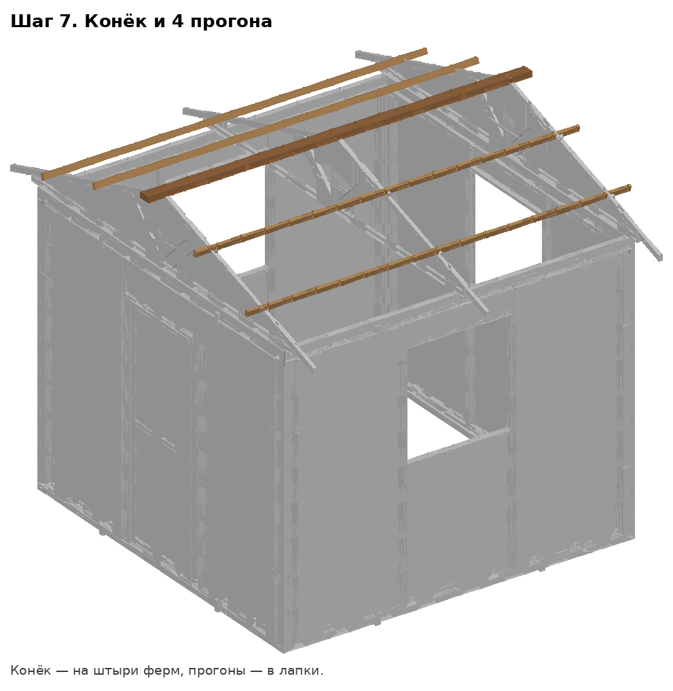

### Шаг 8. Тент и растяжки — 10 мин

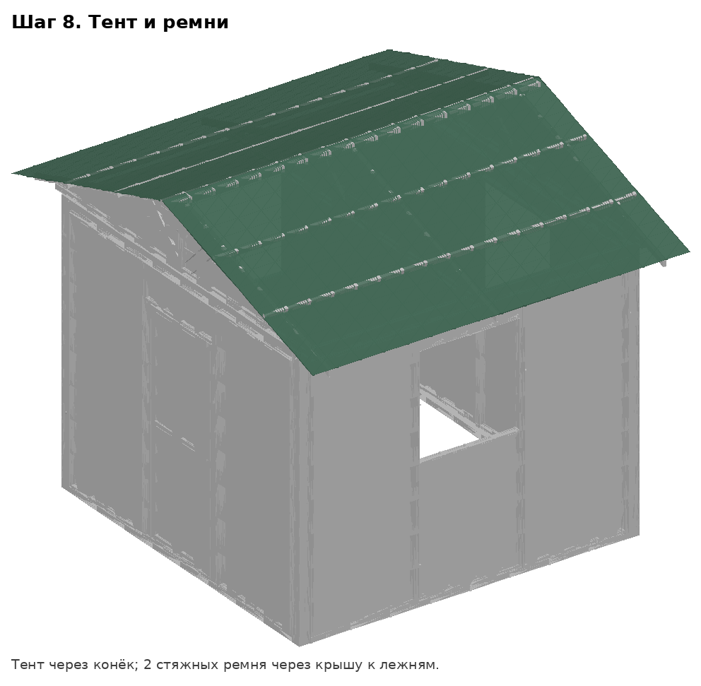

| Этап | Мин |
|---|---|
| Раскладка по маркировке | 10 |
| Основание | 15 |
| Анкеры | 10 |
| Стойки | 5 |
| Ригели | 10 |
| Пролёты | 20 |
| Фермы | 15 |
| Конёк, прогоны | 7 |
| Тент, растяжки | 10 |
| **Итого** | **≈ 100** |

## 4. Разборка — ≈ 45 мин

Тент → прогоны, конёк → шплинты, фермы, разъединить пары → вертушки,
пролёты наружу → ригели → стойки → анкеры → лежни.

---

## 5. Что проверить при осмотре (мои допущения)

* **Пролёт заходит снаружи** на упорные рейки, фиксация — 8 вертушек. Если
  нужно ставить изнутри — рейки переносятся наружу, вертушки внутрь.
* **Щит 997 мм** (зазор 4,5 мм в проёме) — чтобы пролёт входил без подгонки.
  Жёсткость коробке дают пролёты; если зазор «гуляет» — 2 клина на пролёт.
* **Фанера 4 мм** на щитах — даёт жёсткость, весит ~70 кг на дом. Для
  ткани/баннера — вернуть в щиты диагонали.
* **Тент** вместо жёсткой кровли — быстро и без течи на коньке.
* Пола нет; щиты пола можно положить на внутреннюю часть лежней.
