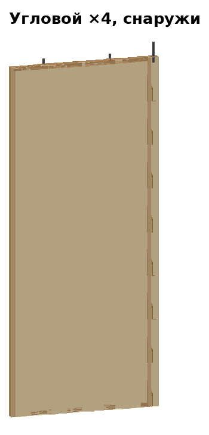
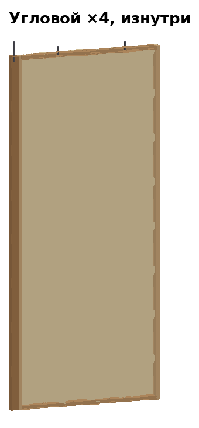
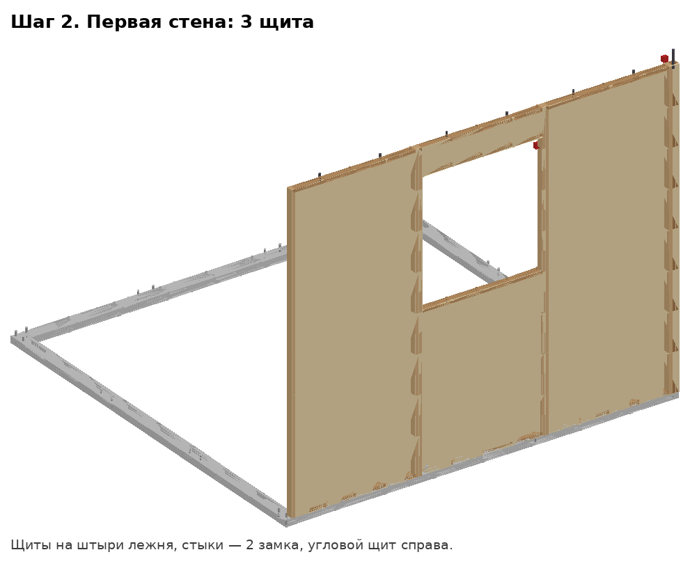
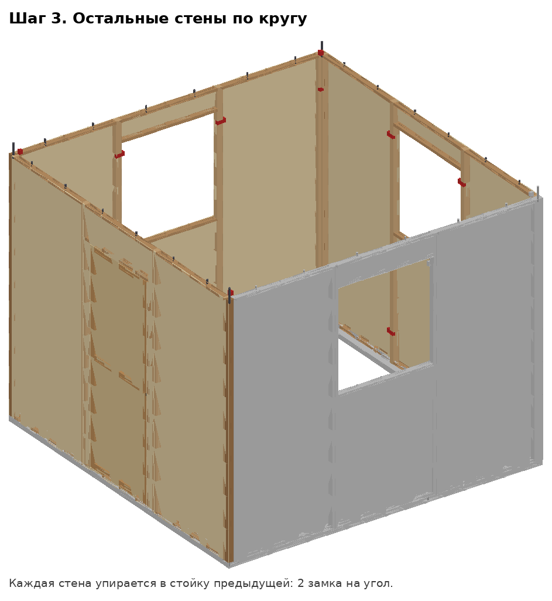
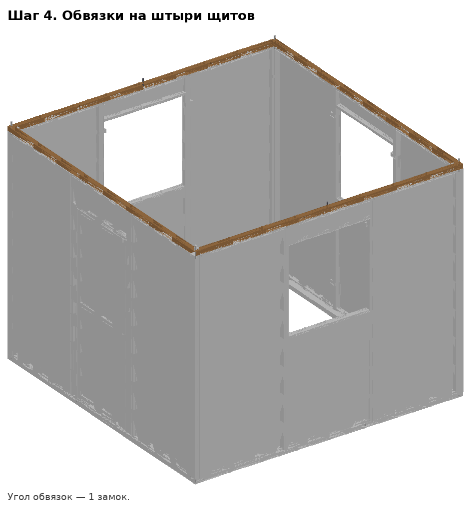
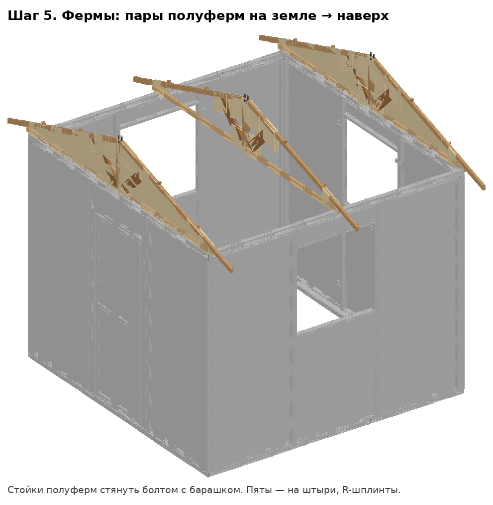
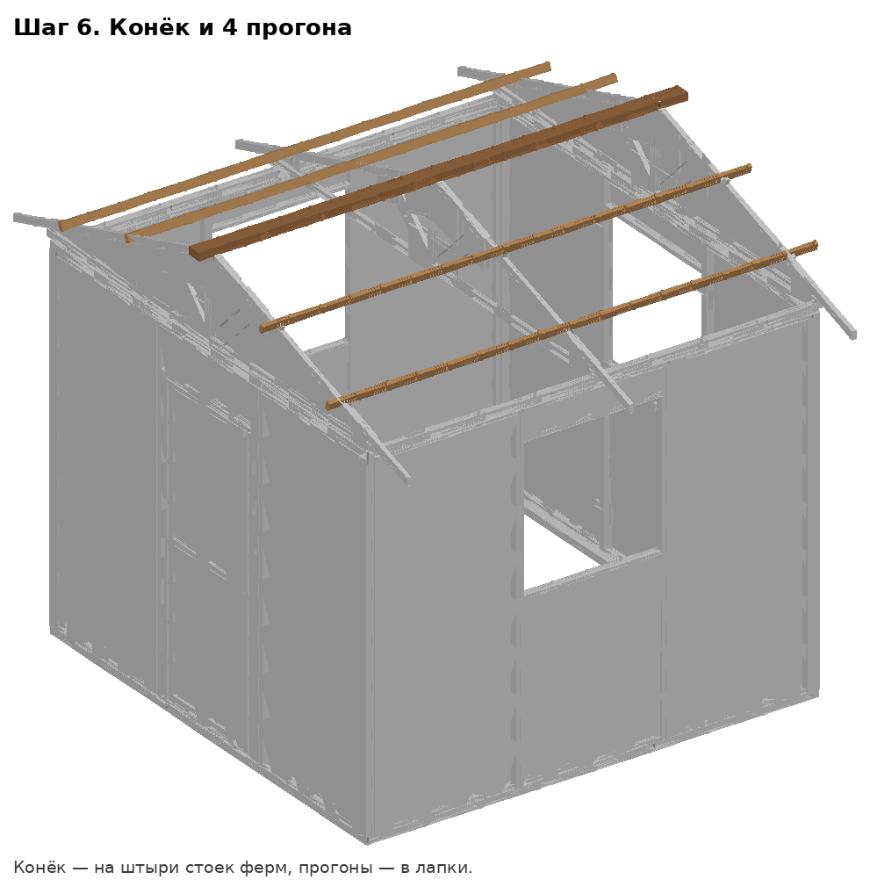

# Дом 3×3, версия 5 — быстроразборный


**Идея.** Дом состоит из готовых **неразборных блоков**: щитов стен и
полуферм, собранных в мастерской на клей и саморезы. На полигоне блоки только
**ставятся на штыри и защёлкиваются**. Все движения — сверху вниз, ключ нужен
только для 3 барашков (и то — рукой). Монтаж — **2 человека, ≈ 1,5 часа**
(с опытом — 70–80 мин).

Модель: `дом_v5_3х3.step`, блоки — `блоки/*.step`, закупка —
[СПЕЦИФИКАЦИЯ.md](СПЕЦИФИКАЦИЯ.md). Генерируется скриптами
`tools/v5_house.py` и `tools/v5_draw.py` — любой размер меняется в начале
скрипта, модель и спецификация пересобираются.

| | |
|---|---|
| Пятно стен | 3100 × 3100 мм |
| С карнизными свесами | 3100 × 3960 (тент 3400 × 3960) |
| Высота: до затяжек / до конька | 2500 / 3164 мм |
| Уклон кровли | 17,6° |
| Масса без тента | ≈ 254 кг |
| Самый тяжёлый блок | щит с дверью, 18 кг |

---

## 1. Комплект

| Блок | Шт. | Масса, кг | Чем отличается |
|---|---|---|---|
| Щит глухой | 4 | 10 | — |
| Щит угловой | 4 | 13,5 | справа приклеена стойка 50×50 |
| Щит «окно» | 3 | 9 | проём 950 × 975 |
| Щит «дверь» | 1 | 18 | проём 800 × 2050, полотно на петлях |
| Обвязка карнизная 50×50×3050 | 2 | 4 | + штырь пяты средней фермы |
| Обвязка фронтонная 50×50×3050 | 2 | 4 | — |
| Лежень X 50×100×3100 | 2 | 8 | нижний в углах (выборка сверху) |
| Лежень Y 50×100×3100 | 2 | 8 | верхний в углах (выборка снизу) |
| Полуферма средняя | 2 | 5,3 | косынки с двух сторон |
| Полуферма фронтонная А / Б | 2 + 2 | 5,7 | обшивка фронтона с одной стороны (А и Б зеркальны) |
| Конёк 50×100×3350 | 1 | 8 | — |
| Прогон 25×50×3350 | 4 | 2 | — |
| Тент ~3,4 × 4,2 м | 1 | | люверсы по краю |
| Ящик фурнитуры | 1 | | 3 болта с барашками, 6 R-шплинтов, 6 анкеров, 4 растяжки |

Всего **31 место** + тент + ящик. Самая длинная деталь — 3350 мм.

Как стоят стены (вид сверху): у каждой стены угловой щит — **справа, если
смотреть снаружи**. Стойка углового щита — угол дома, следующая стена
упирается в неё. Поэтому все 4 угловых щита одинаковые.

```
          C (окно)            ← карнизная
     ┌──────────────────┐
     │                  │
 D   │                  │   B
(дверь)                 │ (окно)    D и B — фронтонные
     │                  │
     └──────────────────┘
          A (окно)            ← карнизная
```

---

## 2. Мастерская: изготовление блоков

Общие правила:
* все узлы — **на клей (ПВА D3) + саморезы**, блоки не разбираются;
* отверстия под штыри сверлить **по кондуктору** (одна планка с отверстиями
  на все одинаковые детали), иначе блоки не будут взаимозаменяемы;
* штыри Ø12 — стальной пруток, вклеить на эпоксидку; отверстия под приёмные
  штыри — Ø13 (зазор 1 мм на влажность и неточность);
* у штырей под R-шплинт — поперечное отверстие Ø4 в 12 мм от верха;
* каждому блоку — **маркировка** краской: тип, номер, стрелка «верх» и
  «наружу»; на лежнях — метки мест щитов.

### 2.1 Щиты стен (12 шт.)

| Глухой | Угловой | «Окно» | «Дверь» |
|---|---|---|---|
|  |  |  |  |
|  |  |  |  |

Рама щита 1000 × 2400, брус 25×50 на ребро (глубина 50):
1. Стойки 25×50×2400 — 2 шт., перемычки 25×50×950 — низ и верх, между стойками.
2. **Нижняя перемычка:** 2 сквозных отверстия Ø13 по центру толщины, в 60 и
   940 мм от левого края щита.
3. **Верхняя перемычка:** 2 штыря Ø12×65, вклеены в 237,5 и 712,5 мм от
   левого края, торчат вверх на 40.
4. **Обшивка** — фанера 4 мм на наружную грань, на клей и саморезы 3,5×25
   шаг 150. Фанера даёт щиту жёсткость, диагонали не нужны.
5. Изнутри — половинки рычажных замков на стыках (см. 3.3): высота 300 и
   2100 от низа щита.

Отличия:
* **Угловой:** справа к стойке вклеена стойка 50×50×2400 (её наружная грань —
  в плоскости обшивки, обшивка 1050 мм закрывает и её). Снизу в стойке —
  отверстие Ø13 глубиной 45 по центру; сверху вклеен штырь Ø12×140
  (торчит на 100: проходит обвязку и пяту фермы, сверху — R-шплинт).
* **«Окно»:** ещё 2 перемычки 950: нижний край на 1187,5 и 2187,5 от низа щита.
  В обшивке вырез 950 × 975 (от 1212,5 до 2187,5).
* **«Дверь»:** 2 стойки 25×50×2050 (в 75 и 900 мм от левого края), перемычка
  950 над проёмом (2075–2100). Проём 800 × 2050, порог — нижняя перемычка
  25 мм. Полотно 790 × 2040: рамка из 25×50 плашмя (2 × 2040 + 3 × 690) +
  фанера 4 мм, 2 петли на левой стойке, ручка и завёртка.

### 2.2 Полуфермы (6 шт.)

| Средняя | Фронтонная А | Фронтонная Б |
|---|---|---|
|  |  |  |


Все элементы 25×50 **на ребро** (50 — в плоскости фермы), в одной плоскости:

| Деталь | Длина | Резы |
|---|---|---|
| Затяжка | 1600 | прямые |
| Стойка | 544 | прямые |
| Стропило | 1972 | верх — вертикальный (упор в стойку), низ — вертикальный (свес) |
| Подкос | 504 | низ — клин 45°/45° в угол затяжка/стойка, верх — по низу стропила |

1. Затяжка лежит горизонтально; на её **коньковый** конец встаёт стойка.
2. Стропило: верхний конец упирается в стойку (верх стойки и стропила — на
   594 мм от низа затяжки), низ стропила ложится на наружный конец затяжки и
   выходит на 330 дальше — карнизный свес ≈ 380 от стены.
3. Подкос — из угла затяжка/стойка под 45° до стропила.
4. **Косынки** — фанера 9 мм на клей + саморезы 4×40: вершина, пята, низ и
   верх подкоса. У средней — с двух сторон, у фронтонных — изнутри.
5. **Фронтонные:** снаружи — фанера 4 мм, закрывает треугольник до наружной
   грани стены (1554 от конька). **А** — обшивка на одной грани, **Б** — на
   другой; в ферме фронтона всегда пара А + Б, обшивкой наружу.
6. Отверстия: в затяжке — вертикальное Ø13 в 1525 от конькового конца
   (пята на штырь); в стойке — горизонтальное Ø9 на середине (болт стяжки
   пары); сверху в стойку вклеен штырь Ø12×80 (торчит на 40, в конёк).
7. На стропило сверху — 2 лапки 25×25×30 (на 650 и 1300 от конька, ниже
   прогона): в них ложатся прогоны.

### 2.3 Обвязки, лежни, конёк, прогоны


* **Обвязка 50×50×3050** (4 шт.): сквозные Ø13 в 237,5 / 712,5 / 1237,5 /
  1712,5 / 2237,5 / 2712,5 (штыри щитов) и 3025 (штырь угловой стойки) от
  левого конца. В **карнизных** (2 шт.) ещё вклеен штырь Ø12×90 в 1500 —
  торчит на 50 под пяту средней фермы и R-шплинт.
* **Лежни 50×100×3100** (4 шт.): по углам выборка вполдерева 100×100×25
  (у лежней X — сверху, у Y — снизу). Вклеены штыри Ø12×80 (торчат на 40)
  в 25 мм от наружной кромки, в 110, 990, 1110, 1990, 2110, 2990 мм от конца.
  В углах лежней X — штыри Ø12×85 (проходят верхний лежень и входят в
  угловую стойку), в лежнях Y там же — отверстия Ø13. Отверстия Ø16 под
  анкеры: по одному в каждом углу и посередине лежней X.
* **Конёк 50×100×3350** плашмя: снизу 6 глухих Ø13 под штыри стоек ферм.
* **Прогоны 25×50×3350** на ребро — без обработки.

---

## 3. Монтаж на полигоне (2 человека)

Инструмент: стремянка, вороток/лом для анкеров, уровень, рулетка.

### Шаг 1. Основание — 15 мин


1. Разложить лежни X (выборкой вверх), сверху — лежни Y (выборкой вниз), углы
   на штыри.
2. Выровнять подкладками (плитка, обрезки доски) — лежни горизонтальны,
   **диагонали равны** (≈ 4384 по наружным углам).

### Шаг 2. Анкеры — 10 мин

Ввернуть 6 анкеров-штопоров через отверстия Ø16 (4 угла + середина лежней X).

### Шаг 3. Стены — 25 мин

| Первая стена | Все стены |
|---|---|
|  |  |

Начинать **с угла**, чтобы конструкция сразу стояла сама:
1. Угловой щит стены A (его стойка садится на угловой штырь) + первый
   (глухой) щит стены B рядом с этой стойкой → защёлкнуть 2 угловых замка.
   Получился устойчивый «уголок».
2. Дальше по кругу: B-«окно», B-угловой, C-глухой, … — каждый щит опускается
   **сверху** на 2 штыря лежня, вплотную к соседу, 2 замка на стык.
3. Последним вставляется глухой и средний щит стены A — тоже сверху, между
   соседями.

Итого 24 замка на стыках щитов и стоек.

### Шаг 4. Обвязки — 5 мин



Положить 4 обвязки на штыри щитов (у каждой стены — своя; карнизные —
на стены A и C). На углах — по 1 замку.

### Шаг 5. Фермы — 15 мин



1. На земле: полуфермы парами стойка к стойке, стянуть **болтом с
   барашком**. Пары: фронтон D = А + Б, середина = 2 средние, фронтон B = Б + А
   (обшивкой наружу).
2. Поднять ферму (12 кг, вдвоём со стремянки и изнутри), пятами — на штыри:
   крайние фермы — на штыри угловых стоек, средняя — на штыри карнизных
   обвязок. На каждую пяту — **R-шплинт** (держит ферму от отрыва ветром).

### Шаг 6. Конёк и прогоны — 7 мин



Конёк — на штыри стоек ферм. 4 прогона — в лапки на стропилах.

### Шаг 7. Тент и растяжки — 10 мин


Тент — через конёк, края — к люверсам/лежням. 4 растяжки от углов
карнизного свеса к колышкам.

| Этап | Мин |
|---|---|
| Раскладка по маркировке | 10 |
| Основание | 15 |
| Анкеры | 10 |
| Стены | 25 |
| Обвязки | 5 |
| Фермы | 15 |
| Конёк, прогоны | 7 |
| Тент, растяжки | 10 |
| **Итого** | **≈ 95** |

## 4. Разборка — ≈ 40 мин

Обратный порядок: тент → прогоны, конёк → R-шплинты, фермы вниз, разделить
на полуфермы → обвязки → замки, щиты вверх со штырей → анкеры → лежни.

---

## 5. Чем v5 отличается от v4

| | v4 | v5 |
|---|---|---|
| Крепёж на площадке | 97 болтов + 14 глухарей, ключи | 28 замков + 6 R-шплинтов + 3 барашка |
| Основание | обвязка 25×50 на земле | лежни 50×100 на подкладках + 6 анкеров |
| Жёсткость стен | диагонали только в 8 рамах | фанера на всех щитах |
| Типы щитов | Л, П, окно, дверь | глухой, угловой, окно, дверь (симметричные) |
| Угловые стойки | отдельные, 20 болтов | приклеены к угловым щитам |
| Фермы | брус плашмя, узлы впритык | на ребро, фанерные косынки |
| Фронтоны | открыты | зашиты фанерой на фермах |
| Кровля | 2 листа встык на коньке | цельный тент на конёк + 4 прогона |
| Дверь | нет проёма | проём 800 × 2050, полотно на петлях |
| Крепление к земле | нет | 6 анкеров + 4 растяжки |

## 6. Что проверить при осмотре (мои допущения)

* **Фанера 4 мм** на щитах — даёт жёсткость, но добавляет ~70 кг к дому.
  Если нужна ткань/баннер — вернуть в щиты диагонали (как в v4).
* **Тент** вместо жёсткой кровли — самый быстрый и герметичный вариант;
  если нужна «деревянная» крыша по антуражу — щиты кровли по прогонам.
* **Замки «лягушка»** — нужен тип с регулировкой натяга; на угол — на
  угловой накладке.
* Ширина щита ровно 1000 — на практике делать 998, чтобы щит входил между
  соседями без подгонки.
* Пола в модели нет: при необходимости — щиты пола на внутреннюю полку
  лежней (50 мм).
