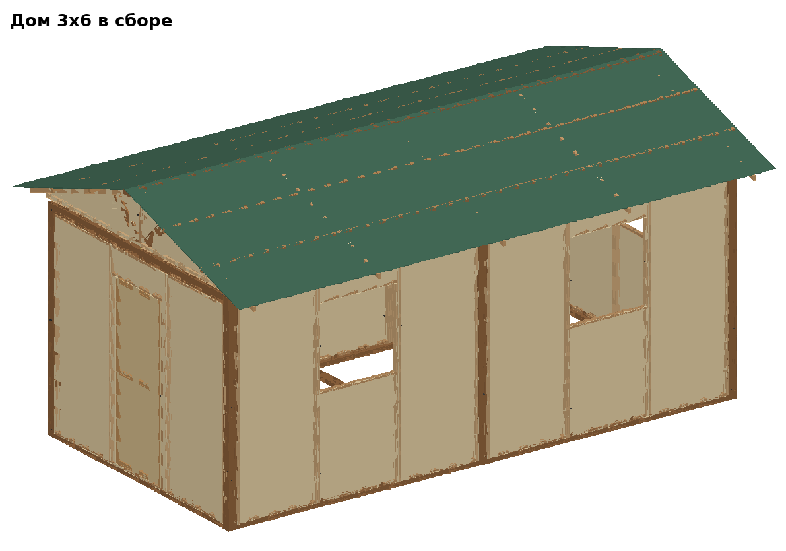
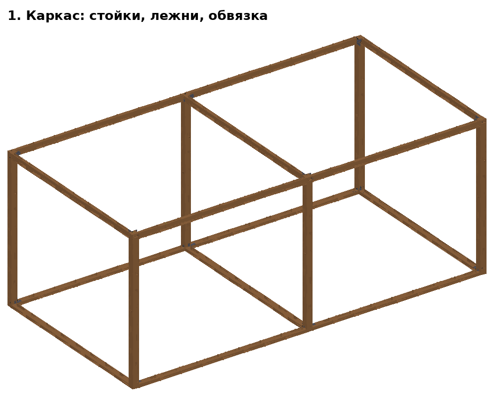
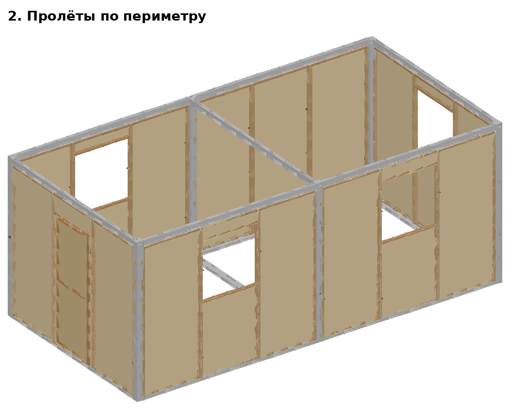
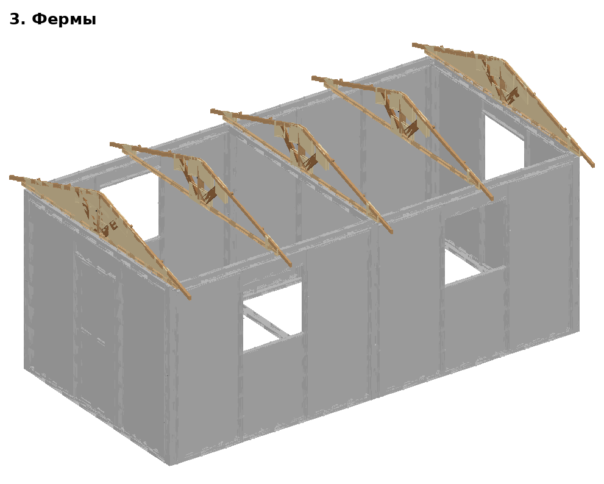
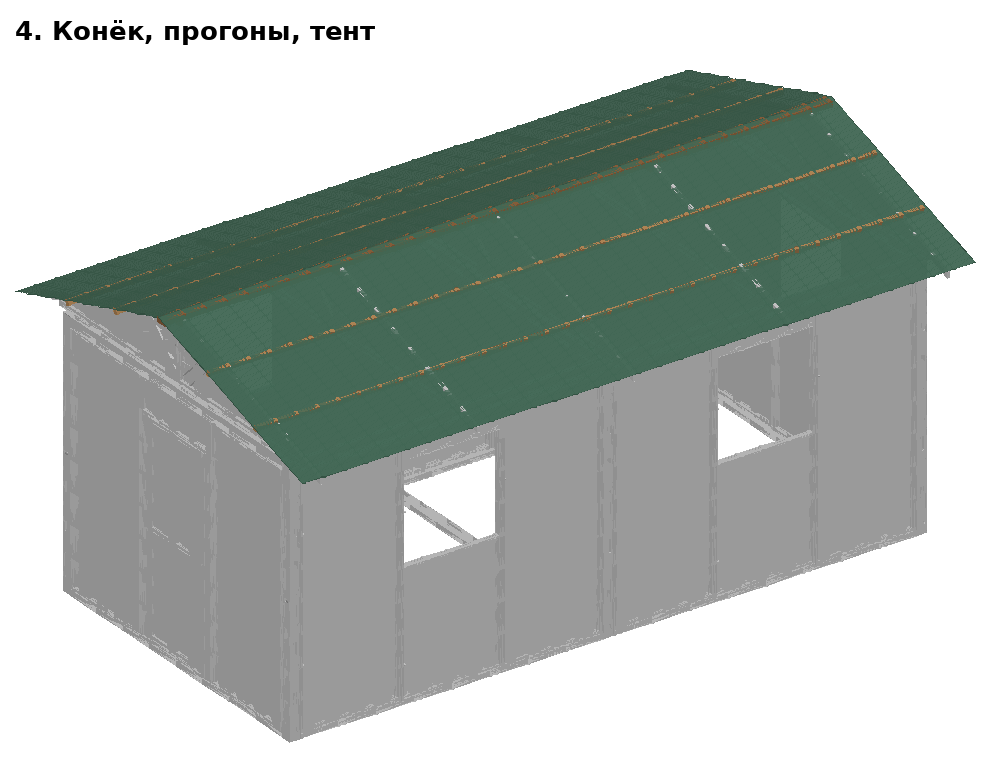

# Сборка дома 3х6



Каркас 6.3 × 3.2 м, высота до конька 3.24 м. Сетка 2 × 1 клеток. Общие правила и описание каждой детали — [../МОНТАЖ.md](../МОНТАЖ.md) и [../ДЕТАЛИ.md](../ДЕТАЛИ.md). Что купить и сколько стоит — [СПЕЦИФИКАЦИЯ_И_СМЕТА.md](СПЕЦИФИКАЦИЯ_И_СМЕТА.md).

## План

Вид сверху, север — сверху, конёк — вдоль длинной стороны (слева направо). ■ — стойка; О — пролёт с окном, Г — глухой, Д — с дверью, · — открытый проём.

```
■─────О─────■─────Г─────■
│           │           │
Д           ·           О
│           │           │
■─────О─────■─────О─────■
```

## Комплект

| Что | Шт. |
|---|---|
| Стойки | 6 |
| Лежни | 7 |
| Верхние обвязки | 7 (вдоль конька — 4, поперёк — 3, перевёрнутые) |
| Пролёты | 4 × «окно», 1 × «глухой», 1 × «дверь» |
| Фермы (малые) | 5: 2 фронтонные (А+Б), 3 средних |
| Конёк / прогоны | 2 / 8 куск. |

## Порядок

1. **Лежни и стойки.** Разложить 7 лежней по плану (уголками внутрь клеток), выровнять подкладками. Ставить стойки от угла: каждая — между концами лежней, болты М10×130 сквозь стойку в уголки (12 шт.). Диагонали каждой клетки равны (≈ 4525). Колья — в лежни по периметру.

   

2. **Верхняя обвязка.** 4 обвязок вдоль конька — уголками вниз; 3 поперёк — перевернуть (уголками вверх). Болт М10×130 сквозь стойку на каждый конец (12 шт.; в середине стены и в центре один болт держит два уголка).
3. **Пролёты** (4 × «окно», 1 × «глухой», 1 × «дверь») — по плану: на лежень между стойками, 4 болта М10×150 сквозь стойки (барашки изнутри) + 2 болта М10×80 изнутри снизу в футорки обвязки.

   

4. **Фермы** (5 шт.): пары полуферм на земле, болт М10×130 с барашком. Крайние — над торцами (фанерой наружу), остальные через 1,55 м. Пяты — болтами М10×80 в футорки: на линиях стоек — в верх стоек, между ними — в середину обвязок.

   

5. **Конёк** (2 куск.) на верх ферм — бобышками по бокам; **прогоны** (8 куск.) — в лапки стропил; **тент** через конёк, края к люверсам/лежням; **ремни** (4 шт.) через крышу под лежни.

   


## Болты на площадке

| Болт | Где | Шт. |
|---|---|---|
| М10×130 | уголки обвязок (верх стоек) | 12 |
| М10×130 | фермы | 5 |
| М10×80 | фермы | 10 |
| М10×130 | уголки лежней (низ стоек) | 12 |
| М10×150 | пролёты к стойкам и обвязке | 24 |
| М10×80 | пролёты к стойкам и обвязке | 12 |
| | **всего** | **75** |

## Время (2 человека, оценка)

| Этап | Мин |
|---|---|
| Раскладка, разметка | 10 |
| Лежни | 21 |
| Стойки (+ колья) | 23 |
| Верхняя обвязка | 28 |
| Пролёты | 36 |
| Фермы | 25 |
| Конёк, прогоны | 12 |
| Тент, ремни | 21 |
| **Итого** | **≈ 176 (2.9 ч)** |

Время — оценка по нормам на операцию, вживую не проверено. Втроём — примерно на треть быстрее.

## Разборка

Обратный порядок: ремни, тент → прогоны, конёк → фермы (разобрать на полуфермы) → пролёты → обвязка → стойки → колья, лежни.
