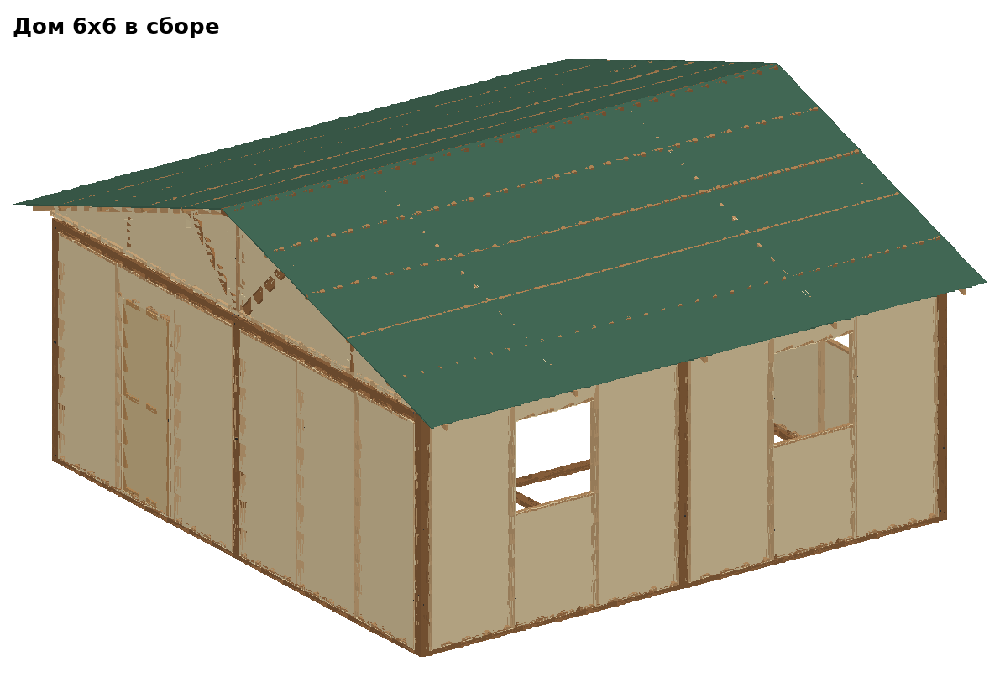

# Модульные игровые дома — документация

Сборно-разборные деревянные дома для ролевых игр. Один набор деталей —
дома любого размера, кратного клетке **3,1 м**. Детали делаются в
мастерской один раз и не разбираются; на площадке всё соединяется
**болтами М10** (большинство — барашками, руками).



## Документы

| Документ | Что внутри |
|---|---|
| [ДЕТАЛИ.md](ДЕТАЛИ.md) | **Мастерская**: как сделать каждую деталь — щиты, пролёты, стойки, лежни, обвязки, полуфермы, конёк, прогоны |
| [МОНТАЖ.md](МОНТАЖ.md) | **Площадка**: общие правила сборки любого дома, крепёж, инструмент, разборка, перевозка |
| [ЗАКУПКА.md](ЗАКУПКА.md) | Что купить, где, сколько стоит — сводка по всем домам |
| [3х3/СБОРКА.md](3х3/СБОРКА.md) | Сборка дома **3×3** — план, комплект, порядок, болты, время |
| [3х6/СБОРКА.md](3х6/СБОРКА.md) | Сборка дома **3×6** |
| [3х9/СБОРКА.md](3х9/СБОРКА.md) | Сборка дома **3×9** |
| [6х6/СБОРКА.md](6х6/СБОРКА.md) | Сборка дома **6×6** |
| `*/СПЕЦИФИКАЦИЯ_И_СМЕТА.md` | Раскрой, крепёж и смета конкретного дома |
| `*/дом_*.step`, [блоки/](блоки/) | 3D-модели (STEP) — открываются в Fusion 360, FreeCAD, SolidWorks |

## Дома

| Дом | Каркас, м | Высота до конька | Пролётов | Ферм | Масса | Смета* | Монтаж вдвоём** |
|---|---|---|---|---|---|---|---|
| [3×3](3х3/СБОРКА.md) | 3,2 × 3,2 | 3,24 | 4 | 3 малых | 285 кг | ≈ 46 тыс. ₽ | ≈ 1,9 ч |
| [3×6](3х6/СБОРКА.md) | 6,3 × 3,2 | 3,24 | 6 | 5 малых | 450 кг | ≈ 72 тыс. ₽ | ≈ 2,9 ч |
| [3×9](3х9/СБОРКА.md) | 9,4 × 3,2 | 3,24 | 8 | 7 малых | 620 кг | ≈ 98 тыс. ₽ | ≈ 4 ч |
| [6×6](6х6/СБОРКА.md) | 6,3 × 6,3 | 3,73 | 8 | 5 больших | 690 кг | ≈ 108 тыс. ₽ | ≈ 4,1 ч |

\* материалы, средние цены строймагов РФ (октябрь 2026), без запаса;
с запасом 10 % — на 10 % больше. \*\* оценка, вживую не проверена; втроём —
примерно на треть быстрее.

## Как устроена система

```
  ■────────■────────■
  │ пролёт │ пролёт │        ■ — стойка 100×100 в каждом узле сетки
  │        │        │        ─ — лежень внизу + обвязка вверху
  ■────────●────────■        ● — внутренняя стойка
  │        │        │        пролёт — стена из 3 щитов
  │        │        │
  ■────────■────────■        шаг сетки 3100 = стойка 100 + проём 3000
```

1. **Каркас.** В каждом узле сетки — **стойка**, соседние клетки делят
   общие стойки. Между любыми двумя соседними стойками внизу — **лежень**,
   вверху — **обвязка**, оба на стальных уголках и болтах.
2. **Стены.** В проём каркаса по периметру ставится **пролёт** — три
   **щита**, стянутых болтами. Пролёты бывают глухие, с окном, с дверью и
   встают в любой проём. Внутренние проёмы открыты.
3. **Крыша.** Двускатная, конёк вдоль длинной стороны. **Фермы** (каждая из
   двух полуферм) стоят на обвязке через 1,55 м; сверху — **конёк**,
   **прогоны** и **тент**.
   * Дом шириной в 1 клетку (3×3, 3×6, 3×9 …) — **малые** полуфермы.
   * Шириной в 2 клетки (6×6, 6×9 …) — **большие** полуфермы, конёк держит
     средняя линия стоек (в зале — столб).

Стойки, лежни, обвязки, щиты, пролёты и полуфермы **одинаковые для любого
дома**. Например, из двух комплектов 3×3 собирается 3×6: остаются лишними
2 стойки, лежень, обвязка, 2 пролёта и 2 фронтонные фермы, не хватает одной
средней фермы. Конёк и прогоны у длинных домов режутся кусками по клетке
(3300/3100 мм), у 3×3 — один кусок 3500.

## Словарик

| Слово | Что это |
|---|---|
| **Щит** | Рама 997 × 2400 из бруска 25×50 на ребро, снаружи — фанера ФСФ 3 мм. Глухой, с окном, с дверью. |
| **Пролёт** | Три щита на болтах — стена 2991 × 2400 × 53 между двумя стойками. |
| **Стойка** | Брус 100×100×2560 в узле сетки. Все стойки одинаковые. |
| **Лежень** | Брус 50×100×2996 на земле между двумя стойками, на него ставится пролёт. |
| **Обвязка** | Брус 50×100×2996 на ребро между верхами двух стоек, на неё встают фермы. Одна деталь на все места; поперёк конька её ставят перевёрнутой. |
| **Уголок** | Стальной крепёжный уголок KUU 90×90×40 — держит лежень и обвязку на стойке. |
| **Ферма / полуферма** | Треугольник под крышу. Ферма = 2 полуфермы на одном болте. Крайние фермы (фронтонные) зашиты фанерой. |
| **Конёк, прогон** | Брус 50×100 по верху ферм и рейки 25×50 поперёк ферм — под тент. |
| **Косынка** | Фанерная накладка 9 мм на узле фермы (клей + саморезы). |
| **Футорка** | Врезная гайка М10 — втулка с резьбой, вкручивается в дерево. |
| **Барашек** | Гайка М10 с «ушками», крутится рукой. |
| **Клетка** | Квадрат сетки 3,1 × 3,1 м между четырьмя стойками. |

## Модели и генератор

Всё — модели, раскрой, сметы, инструкции по сборке и картинки —
генерируется скриптами из одной параметрической модели:

```
pip install build123d scipy pillow
python tools/grid_house.py 6х6 step/6/6х6 step/6/блоки   # STEP, смета, СБОРКА.md
python tools/grid_draw.py 6х6 step/6/6х6/img              # картинки дома
python tools/grid_draw.py детали step/6/img_детали        # картинки деталей
```

Новый размер — одна строка в `CONFIGS` (`tools/grid_house.py`): число клеток
по X (вдоль конька, любое) и по Y (1 или 2) и что стоит в каждом проёме
периметра. Модели проверены на пересечения деталей и на то, что каждый болт
проходит через нужные детали с запасом под гайку.
