# Детали — изготовление в мастерской

Все детали делаются один раз и **не разбираются**. Сколько каких деталей
нужно для конкретного дома — в его `СБОРКА.md` и `СПЕЦИФИКАЦИЯ_И_СМЕТА.md`.

## Общие правила

* **Материалы**: брусок 25×50 сухой строганый, брус 100×100, доска/брус
  50×100, фанера **ФСФ 3 мм** 1220×2440 (обшивка) и **ФК 9 мм** (косынки).
* **Соединения внутри деталей** — клей ПВА D3 + саморезы: узлы рам и ферм —
  5×70, косынки и уголки — 4×40, фанера обшивки — 3,5×25 через 150 мм.
* **Отверстия под болты М10 — сверло 11 мм**, под футорки — 14 мм.
  Одинаковые детали сверлить **по кондуктору** (шаблон из доски с
  просверленными отверстиями), иначе детали не будут подходить к любому месту.
* Футорка М10 вкручивается шестигранником (или забивается — усовая).
* **Антисептик** — на все деревянные детали до сборки, особенно лежни и
  торцы. Фанеру ФСФ можно покрасить фасадной краской — не обязательно.
* **Маркировка** краской на каждой детали: тип, «верх», «наружу».

Размеры в мм. Высоты отверстий — **от низа детали**, если не сказано иное.

---

## 1. Щиты

| Глухой | С окном | С дверью |
|---|---|---|
| 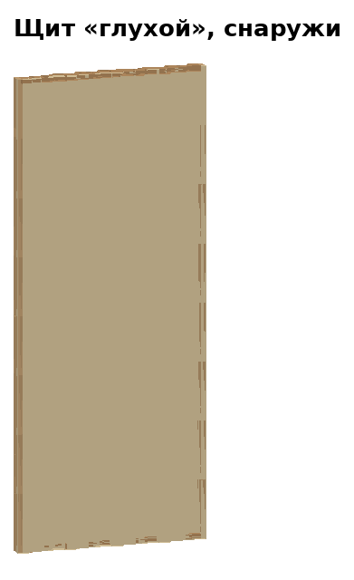 | 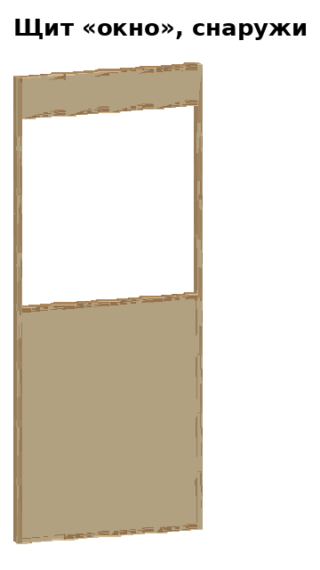 | 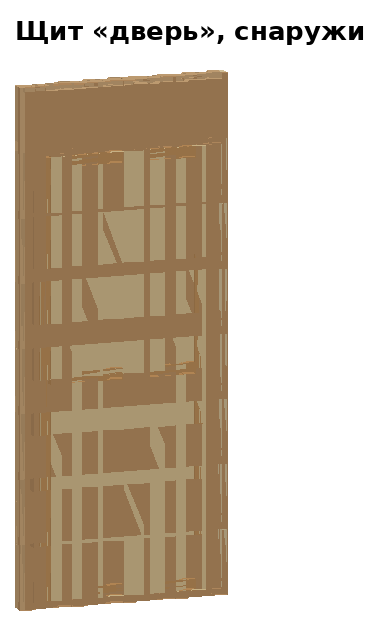 |
| 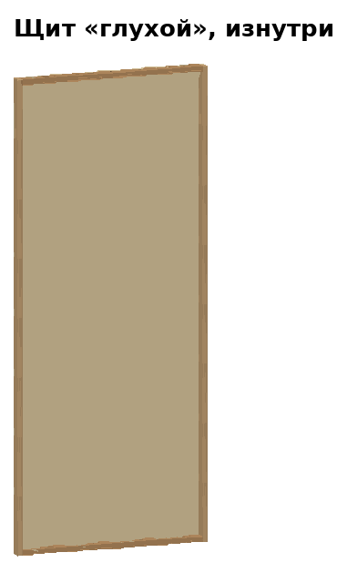 | 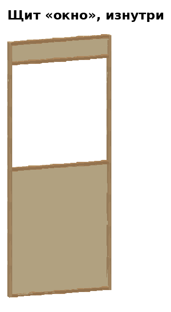 | 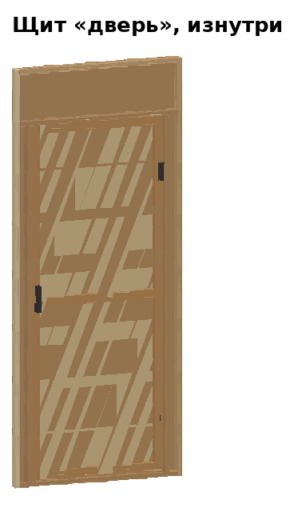 |

**Общее для всех щитов** (997 × 2400 × 50 + фанера 3 мм):
1. Рама: 2 стойки 25×50×2400 + 2 перемычки 25×50×947 (низ и верх),
   брусок **на ребро** (толщина рамы 50). Углы — клей + 2 самореза 5×70.
2. Отверстия 11 мм поперёк обеих стоек, посередине толщины, на высоте
   **300, 1000, 1700** — стяжка щитов в пролёт.
3. Обшивка снаружи — лист ФСФ 3 мм 1220×2440, обрезанный до 997×2400, на
   клей и саморезы 3,5×25 через 150 мм. Фанера держит щит от перекоса —
   диагонали не нужны.

**Глухой** (идёт по краям каждого пролёта) — дополнительно:
* в обеих стойках ещё отверстия на **400, 500, 600, 700, 1200, 1300, 1800,
  1900** — болты к стойкам каркаса (используется 2 из 8, в зависимости от
  места пролёта — поэтому любой пролёт встаёт в любой проём);
* в верхней перемычке посередине — вертикальное отверстие 11 мм (болт к
  обвязке).

**С окном**: ещё 2 перемычки 947 — низ на 1187,5 и 2187,5. Вырез в фанере
947 × 975 (проём от 1212,5 до 2187,5).

**С дверью**: 2 стойки 25×50×2050 (в 73,5 и 898,5 от левого края, от
нижней перемычки), перемычка 947 на высоте 2075. Проём **800 × 2050**,
порог 25. Полотно 790 × 2040: рамка из бруска 25×50 плашмя (2 × 2040 +
3 × 690) + ФСФ 3 мм; 2 петли 100 мм на левую стойку, ручка-скоба, шпингалет.

## 2. Пролёты

| Окно | Глухой | Дверь |
|---|---|---|
| 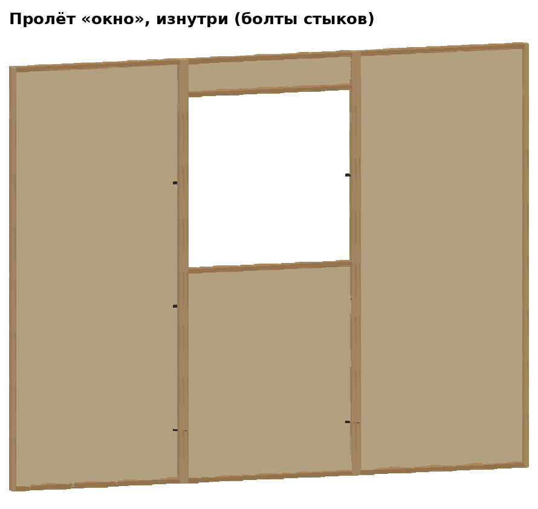 | 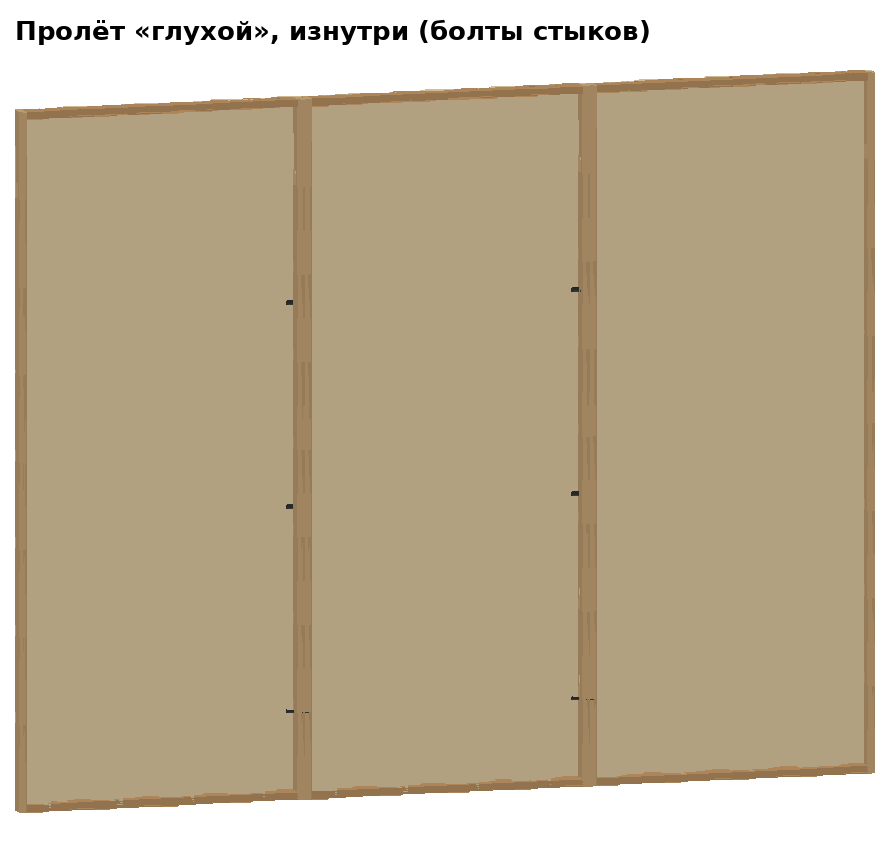 | 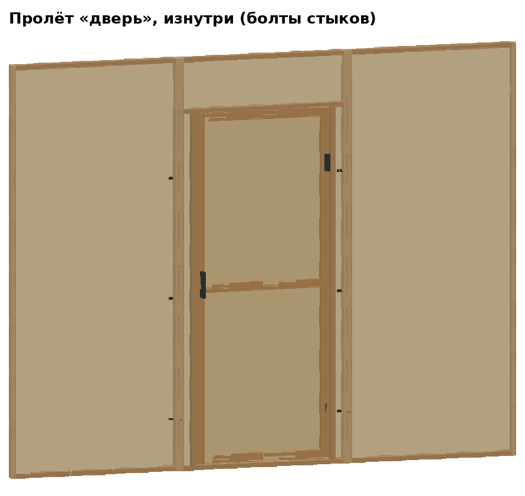 |

Пролёт = **глухой щит + средний щит + глухой щит**, стойки вплотную:

| Пролёт | Средний щит |
|---|---|
| «окно» | с окном |
| «глухой» | глухой |
| «дверь» | с дверью |

На каждом стыке — **3 болта М10×80 с гайкой и шайбами** (высота 300, 1000,
1700), всего 6 на пролёт. Готовый пролёт 2991 × 2400 × 53, масса 25–34 кг.
Если пролёт не влезает в транспорт — везти щитами и стягивать на месте.

## 3. Стойка

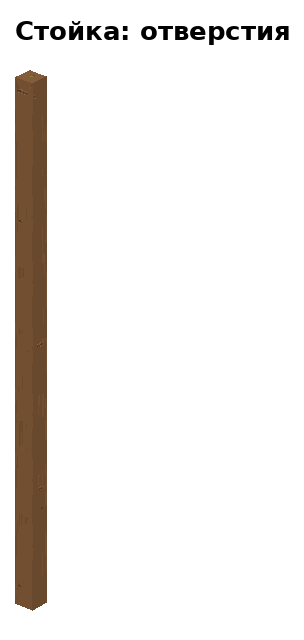

**Брус 100×100×2560**, все стойки одинаковые — угловые, в середине стены и
в центре. Стойки не поворачиваются: «X» — направление вдоль конька, «Y» —
поперёк; стойку ставят меткой «X» вдоль конька.

Сквозные отверстия 11 мм. Каждое — **парой**, симметрично относительно
середины стойки (на указанном расстоянии от одной грани и от противоположной):

| Назначение | Направление X: высота / от грани | Направление Y: высота / от грани |
|---|---|---|
| Уголок лежня | 80 / 23 и 77 | 115 / 23 и 77 |
| Пролёт, левый край | 650 и 1850 / 28 и 72 | 450 и 1250 / 28 и 72 |
| Пролёт, правый край | 750 и 1950 / 28 и 72 | 550 и 1350 / 28 и 72 |
| Уголок обвязки | 2485 / 25 и 75 | 2535 / 25 и 75 |

Итого 24 отверстия (12 в каждом направлении); разные высоты для X и Y — чтобы
отверстия не пересекались внутри стойки. **Сверлить по кондуктору**: короб из
досок, надеваемый на стойку, с отверстиями-направляющими.

Сверху по центру — отверстие 14 мм глубиной 36, футорка М10 (пята фермы).

## 4. Лежень

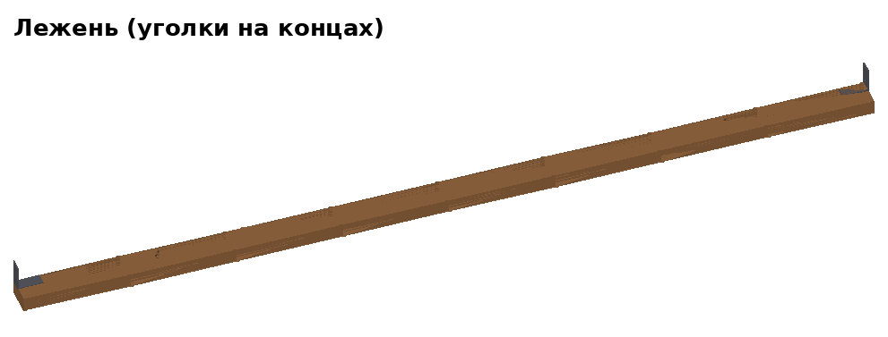

**Брус 50×100×2996**, кладётся плашмя. Все лежни одинаковые.
* На обоих концах сверху — **уголок KUU 90×90×40**: вертикальная полка
  вровень с торцом лежня (смотрит на стойку), полка по ширине — от 57 до 97
  мм от наружной кромки. Саморезы 4×40.
* В вертикальной полке уголка нужны отверстия на высоте **30 и 65 мм** над
  лежнем (у KUU отверстия есть; если не совпали — досверлить 11 мм).
  Лежень вдоль конька крепится через нижнее (30), поперёк — через верхнее
  (65): так все лежни одинаковые.
* 2 отверстия 14 мм под колья — в 498 мм от концов, в 77 мм от наружной
  кромки (используются у лежней по периметру).

## 5. Обвязка

| Вдоль конька | Поперёк конька (перевёрнута) |
|---|---|
| 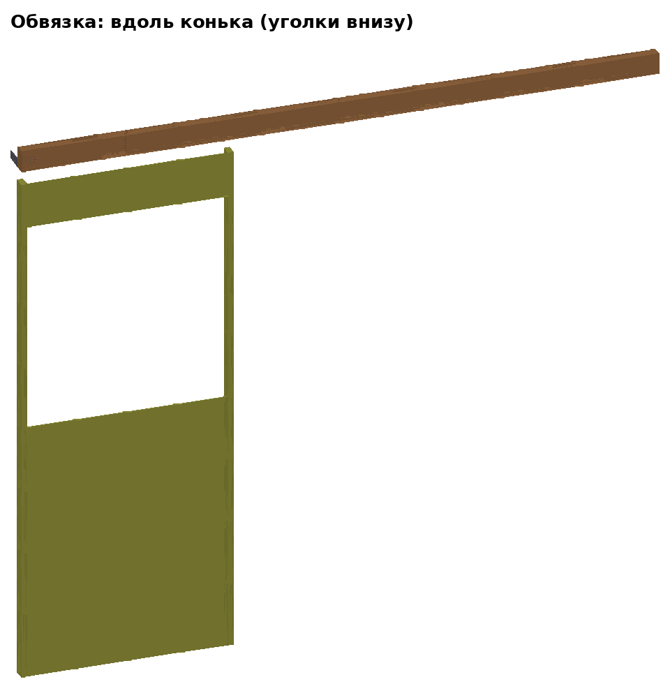 | 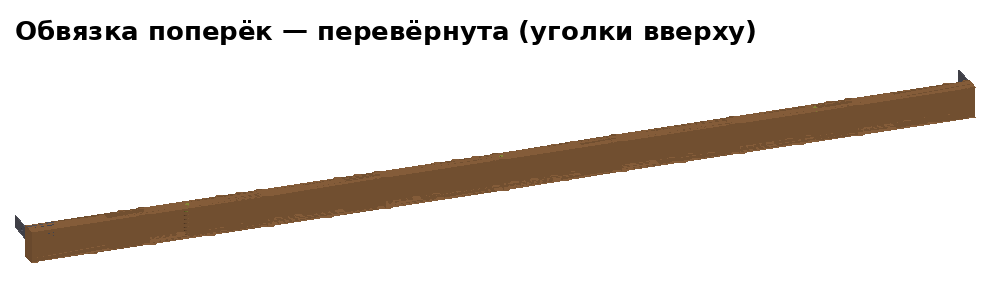 |

**Брус 50×100×2996 на ребро**, одна деталь на все места.
* На обоих концах на внутренней грани — **уголок KUU 90×90×40**:
  вертикальная полка вровень с торцом, по высоте — от 5 до 45 мм от нижней
  грани; отверстие уголка — на 25 мм от низа.
* **6 футорок М10**: по три на нижней и верхней грани — в 501, 1498 и 2495
  мм от конца, в 28 мм (крайние) и 25 мм (средняя) от наружной грани.
  Нижние — под болты пролёта, верхняя средняя — под пяту фермы.
* **Вдоль конька** обвязка ставится уголками вниз. **Поперёк конька** —
  переворачивается (уголками вверх): уголки оказываются на высоте 75 мм от
  низа — как раз под отверстия «Y» в стойке, футорки меняются местами.

## 6. Полуфермы

Брусок 25×50 **на ребро**, все детали в одной плоскости. Узлы — **фанерные
косынки 9 мм** на клей и саморезы 4×40: у средних полуферм — с двух сторон,
у фронтонных — с внутренней. На стропиле — **лапки** 25×25×30 под прогоны.

### 6.1 Малые (дома шириной 3 м: 3×3, 3×6, 3×9)

| Средняя | Фронтонная А | Фронтонная Б |
|---|---|---|
| 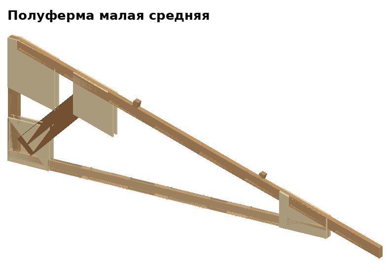 | 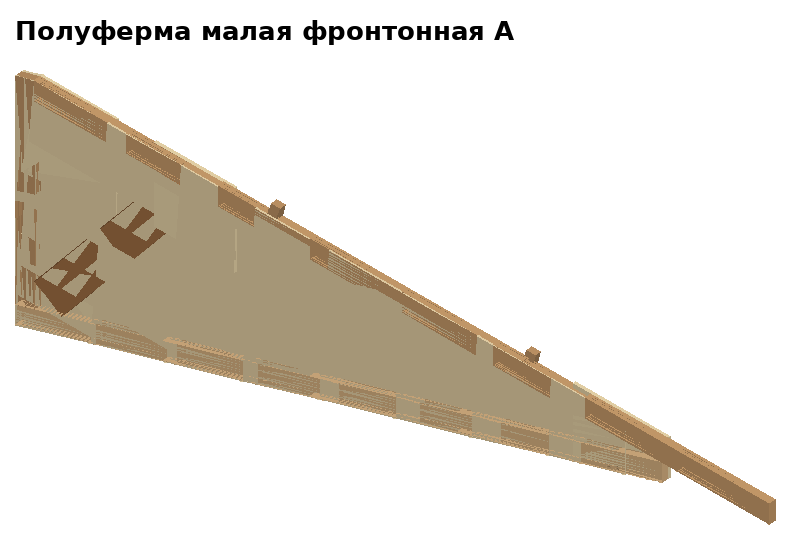 | 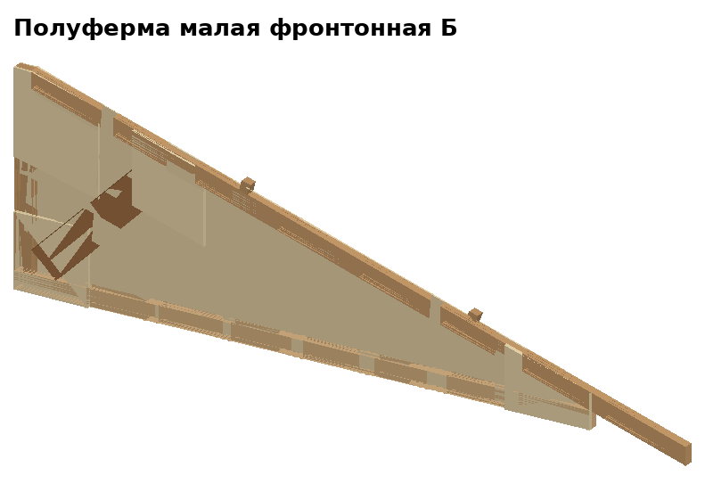 |

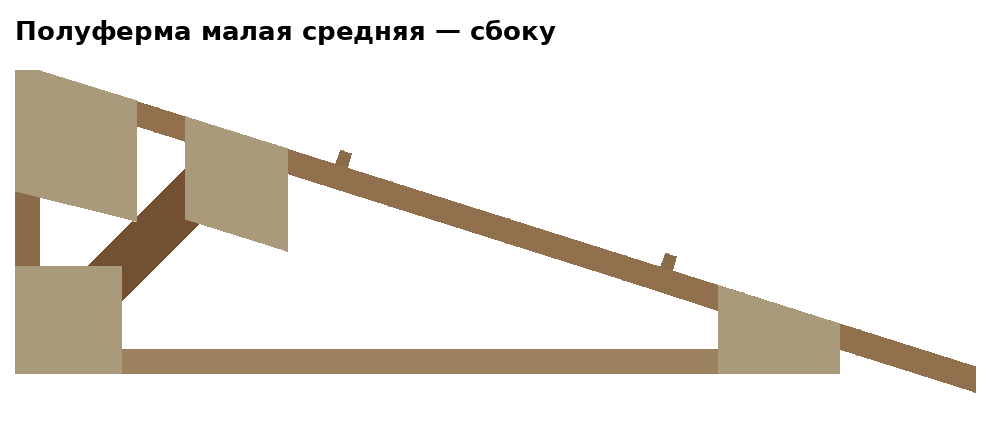

| Деталь | Длина | Как стоит |
|---|---|---|
| Затяжка | 1700 | горизонтально |
| Стойка | 576 | вертикально на коньковом конце затяжки |
| Стропило | 2025 | верх — вертикальный рез в стойку; низ — вертикальный рез, свес ≈ 380 за стену |
| Подкос | 538 | из угла затяжка/стойка под 45° до стропила |

* Отверстия 11 мм: в затяжке — вертикальные на **1550 и 1575** от
  конькового конца (пята на стойке / на обвязке); в стойке — поперёк
  посередине (болт пары).
* Лапки — на 650 и 1320 от конька.

### 6.2 Большие (дома шириной 6 м: 6×6, 6×9)

| Средняя | Фронтонная А | Фронтонная Б |
|---|---|---|
| 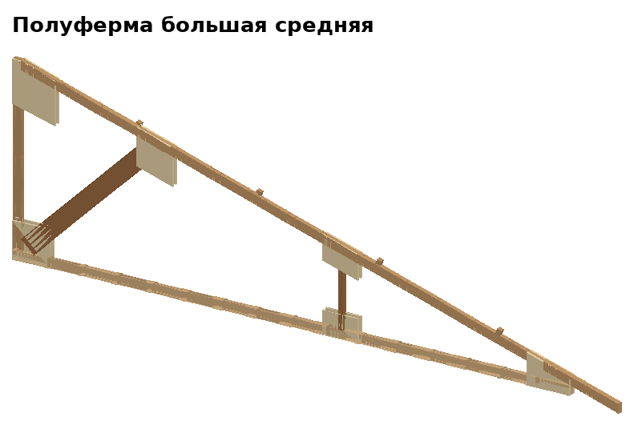 |  | 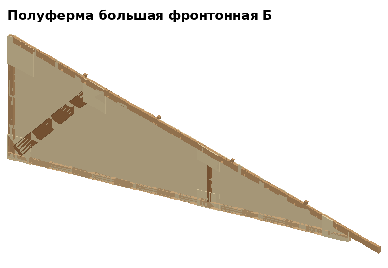 |

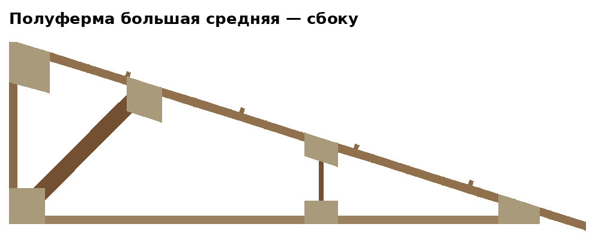

| Деталь | Длина | Как стоит |
|---|---|---|
| Затяжка | 3250 | горизонтально |
| Стойка | 1068 | вертикально на коньковом конце |
| Стропило | 3651 | как у малой, свес ≈ 380 |
| Подкос | 1066 | из угла под 45° до стропила |
| Бабка | 420 | вертикальная распорка на 1900 от конька |

* Отверстия 11 мм в затяжке — на **3100 и 3125** от конькового конца;
  в стойке — поперёк посередине.
* Лапки — на 700, 1400, 2100, 2800 от конька.

### Фронтонные А и Б

Крайние фермы дома **зашиты снаружи фанерой ФСФ 3 мм** (треугольник до
наружной грани стены) — это фронтоны. А и Б — зеркальные: фанера на разных
сторонах. В ферме фронтона всегда пара **А + Б**, фанерой наружу дома.

## 7. Конёк и прогоны

* **Конёк** — брус 50×100 плашмя: у дома 3×3 — один кусок 3500, у длинных —
  кусками по клетке (крайние 3300, средние 3100), стыки — над фермами на
  линиях стоек.
* Снизу у конька — **бобышки** 25×50×100 по обе стороны от каждой фермы
  (просвет 45 мм): конёк ложится на фермы и не сползает.
* **Прогоны** — брусок 25×50 на ребро, такими же кусками; ложатся в лапки
  стропил. 2 на скат у малых ферм, 4 — у больших.

## 8. Кондукторы (сделать один раз)

| Кондуктор | Для чего |
|---|---|
| Короб на стойку 100×100 | 24 отверстия стойки |
| Планка на стойку щита | отверстия 300/1000/1700 (+ 400…1900 у глухих) |
| Планка на обвязку | 6 футорок |
| Шаблон полуфермы на полу (обрезки, прибитые к щиту) | одинаковые полуфермы |
