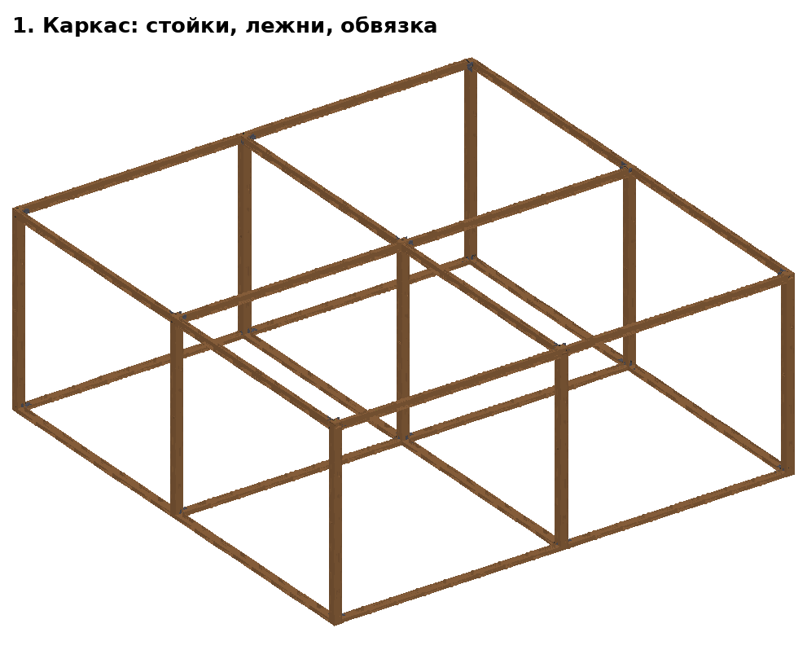
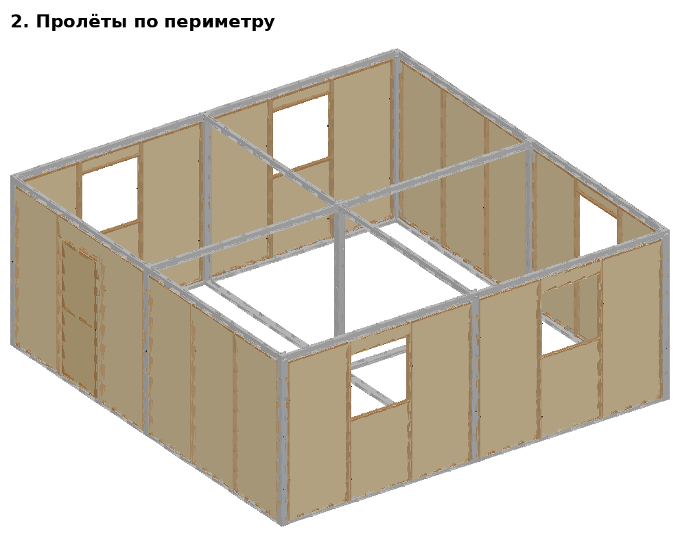
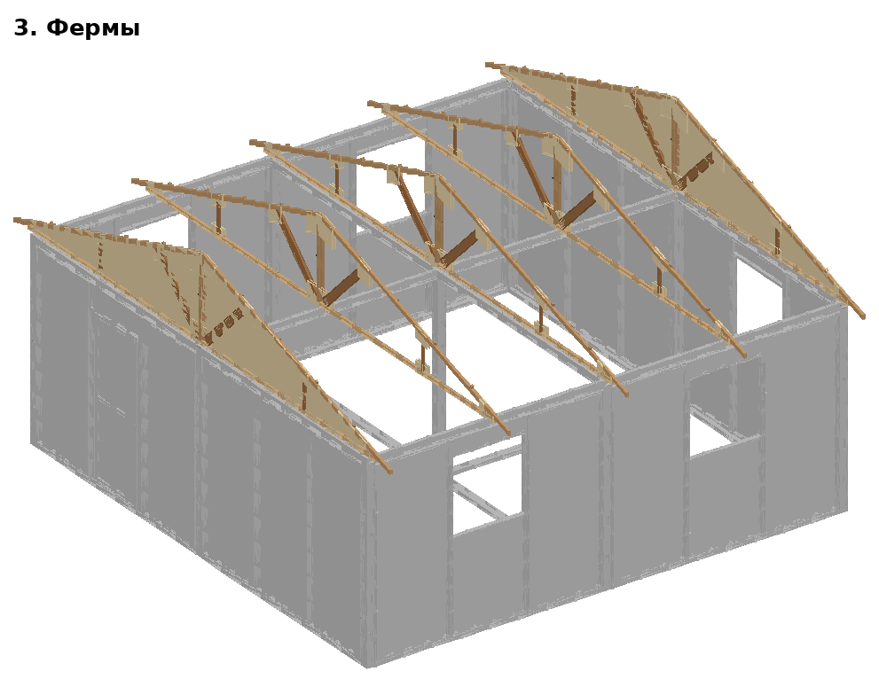
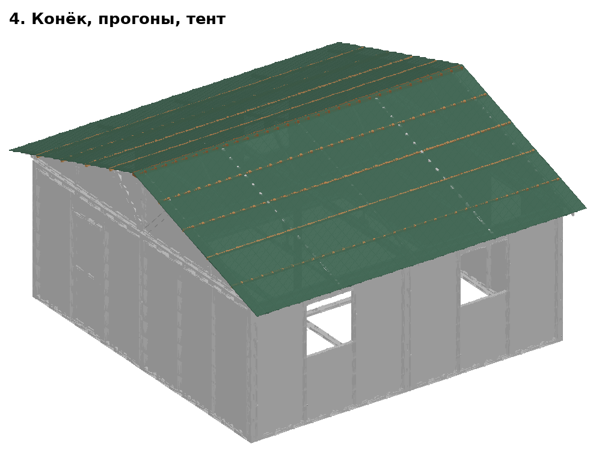

# Монтаж — общие правила для любого дома

Порядок одинаковый для всех домов системы. Конкретный дом — план, сколько
чего и сколько болтов — в его `СБОРКА.md`:
[3×3](3х3/СБОРКА.md) · [3×6](3х6/СБОРКА.md) · [3×9](3х9/СБОРКА.md) · [6×6](6х6/СБОРКА.md).

## Люди и инструмент

* **2 человека** (дом 6×6 и большие фермы — лучше 3).
* Ключ на 17 (рожковый + накидной), стремянка 1,5–2 м (2 шт. для ферм),
  кувалда (колья), уровень, рулетка 5 м, шнур.
* Барашки затягиваются рукой; ключ нужен только для болтов в футорки и
  гаек в пролётах.

## Крепёж — все болты М10

| Болт | Где на площадке |
|---|---|
| **М10×130 + барашек** | уголки лежней и обвязок к стойкам (сквозь стойку); пара полуферм в ферму |
| **М10×150 + барашек** | пролёт к стойкам (сквозь стойку в крайнюю стойку пролёта) |
| **М10×80** | пролёт к обвязке (изнутри снизу в футорку); пяты ферм (в футорку стойки или обвязки) |

На каждый болт — увеличенная шайба под головку и под гайку/барашек.
Головка болта — снаружи дома, барашек — внутри.
**Болт в середине стены и в центре** проходит сквозь стойку и держит уголки
с обеих сторон сразу.

## Порядок сборки

### 1. Разметка и лежни
* Площадка — ровная, без камней. Разложить лежни по плану (`СБОРКА.md`),
  уголками внутрь клеток. Под лежни — подкладки (плитка, обрезки доски),
  выровнять уровнем.

### 2. Стойки
* Начинать **с угла**. Стойка встаёт между концами двух лежней, метка «X»
  — вдоль конька. Болт М10×130 снаружи сквозь стойку в уголок лежня,
  барашек.
* Каждая следующая стойка — по плану. В середине стены и в центре один
  болт держит уголки двух лежней.
* Проверить **диагонали каждой клетки** — около 4525 мм.
* Забить колья (арматура Ø12, 1 м) в отверстия лежней по периметру.

### 3. Верхняя обвязка
* Со стремянки: обвязку — между верхами стоек, вровень с ними, болт
  М10×130 сквозь стойку в уголок на каждый конец.
* **Вдоль конька — уголками вниз, поперёк — перевернуть (уголками вверх).**
  Перепутать нельзя: иначе болт не попадёт в отверстие стойки.
* Пока нет пролётов, каркас «гуляет» — стойки придерживать.

### 4. Пролёты

* Вдвоём поставить пролёт на лежень между стойками, фанерой наружу
  (заводить можно снаружи или изнутри — до обвязки 10 мм зазор).
* **4 болта М10×150** снаружи сквозь стойки в крайние стойки пролёта,
  барашки изнутри. Высоты разные для разных мест — болт попадёт только в
  своё отверстие.
* **2 болта М10×80** изнутри снизу вверх сквозь верхнюю перемычку пролёта
  в футорки обвязки, ключом.
* После пролётов каркас становится жёстким (держит фанера).

### 5. Фермы

* На земле сложить полуфермы парами стойка к стойке, болт М10×130 с
  барашком. Крайние фермы — **А + Б** фанерой наружу дома, остальные —
  две средние.
* Поднять ферму на обвязку (по человеку на стремянке с каждой стороны;
  большие — втроём). Крайние — над торцами дома, остальные — через 1,55 м
  (над каждой линией стоек и посередине между ними).
* **Пяты** — болт М10×80 сверху сквозь затяжку в футорку: на линии стоек —
  в верх стойки, между ними — в середину обвязки.
* Пока нет конька, ферма может завалиться вдоль дома — придерживать.

### 6. Конёк, прогоны, тент

* **Конёк** — сразу после ферм, кусками от фронтона: на верх ферм, бобышки
  по обе стороны фермы, стыки кусков — над фермами.
* **Прогоны** — в лапки стропил.
* **Тент** — через конёк, края привязать за люверсы к лежням/кольям.
  Поверх — **стяжные ремни** через всю крышу (по 2 на клетку вдоль конька),
  концы под лежни, затянуть храповиком. Ремни прижимают тент, конёк и
  прогоны — их ничем больше не крепят.

## Разборка

Обратный порядок: ремни, тент → прогоны, конёк → болты пят, фермы вниз,
разобрать на полуфермы → пролёты (сначала болты к обвязке, потом к
стойкам) → обвязка → стойки → колья → лежни. Болты и барашки — сразу в
ящик по длинам.

## Перевозка

| Деталь | Размер | Масса |
|---|---|---|
| Пролёт | 2991 × 2400 × 53 | 25–34 кг |
| (или щит) | 997 × 2400 × 53 | 8–17 кг |
| Стойка | 100×100×2560 | 13 кг |
| Лежень / обвязка | 50×100×2996 | 8–10 кг |
| Полуферма малая / большая | ≈ 1980×680 / 3530×1170 | 5,5 / 9 кг (ферма — 11 / 19 кг) |
| Конёк, прогоны | до 3500 | до 9 кг |

Пролёты 3 × 2,4 м — Газель с тентом или прицеп; если нет — щитами.

## Безопасность

* На тентовую крышу **не залезать**.
* В сильный ветер (> 15 м/с) — проверить ремни и колья; без кольев и
  ремней дом может сдвинуть ветром.
* Пролёты и фермы поднимать вдвоём, стремянки — на ровном.
