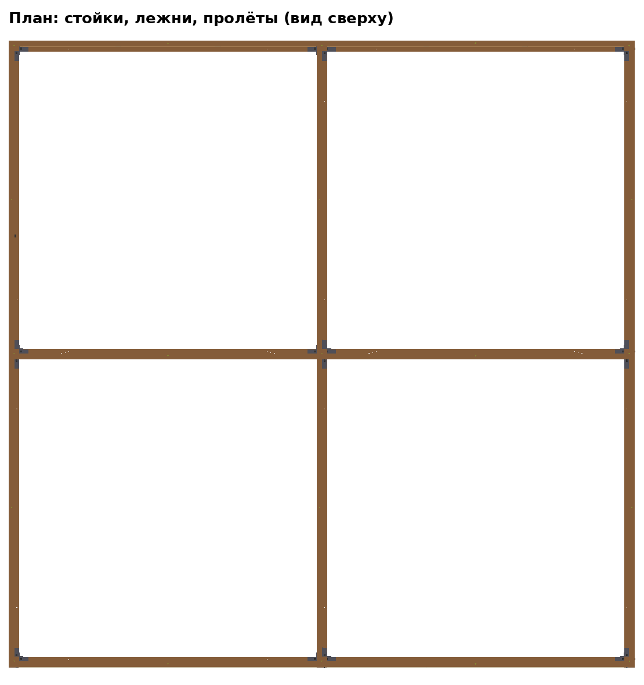

# Модульная система домов (версия 6)

Один набор деталей, из которого собирается дом любого размера, кратного
клетке **3,1 м**: 3×3, 3×6, 6×6, 9×3, «Г», «П» и т. д. Домик 3×3 из версии 5 —
частный случай этой системы (сетка 1×1).

| Конфигурация | Каркас, м | Высота до конька | Масса | Смета (строймаг) |
|---|---|---|---|---|
| [3×3](3х3/СПЕЦИФИКАЦИЯ_И_СМЕТА.md) | 3,2 × 3,2 | 3,24 м | ≈ 285 кг | ≈ 45 тыс. ₽ (с запасом ≈ 50) |
| [6×6](6х6/СПЕЦИФИКАЦИЯ_И_СМЕТА.md) | 6,3 × 6,3 | 3,73 м | ≈ 690 кг | ≈ 107 тыс. ₽ (с запасом ≈ 117) |


## 1. Принцип: сетка

```
  ■────────■────────■
  │ пролёт │ пролёт │        ■ — стойка 100×100 (в каждом узле сетки)
  │        │        │        ─ — лежень внизу + обвязка вверху (между стойками)
  ■────────●────────■        ● — внутренняя стойка
  │        │        │
  │        │        │        шаг сетки 3100 = стойка 100 + проём 3000
  ■────────■────────■
```

* **Стойки стоят в узлах сетки, соседние клетки делят общие стойки.**
* **Между любыми двумя соседними стойками** — одинаковые лежень (низ) и
  обвязка (верх) на уголках, и проём 3000 × 2410.
* В проём по периметру ставится **пролёт** (глухой, с окном или с дверью),
  внутренние проёмы — открытые (или пролёт-перегородка).
* Крыша — двускатная, конёк вдоль длинной стороны:
  * ширина 1 клетка (3×3, 3×6, 3×9…) — **малые фермы**;
  * ширина 2 клетки (6×6, 6×9…) — **большие фермы**, средняя линия стоек
    держит конёк (в зале стоит столб).

## 2. Детали системы

Все детали одинаковые для любого размера — их можно возить и
переставлять между домами.

| Деталь | Размер, мм | Где |
|---|---|---|
| Стойка | 100×100×2560 | каждый узел сетки (угол, стена, центр) |
| Лежень | 50×100×2996 + 2 уголка | низ каждого ребра сетки |
| Обвязка | 50×100×2996 (на ребро) + 2 уголка + 3 футорки | верх каждого ребра |
| Пролёт глухой / окно / дверь | 2991×2400×53 (3 щита) | рёбра по периметру |
| Малая полуферма (средняя, фронтонная А/Б) | ≈ 1980×680 | дом в 1 клетку шириной |
| Большая полуферма (средняя, фронтонная А/Б) | ≈ 3530×1170 | дом в 2 клетки шириной |
| Конёк, прогоны | 50×100 и 25×50, кусками по 3,3 м (по клеткам) | по крыше |

STEP каждой детали — в [блоки/](блоки/).

### Стойка — одна на все узлы

Стойки **не поворачиваются** и все одинаковые. Отверстия 11 мм — сквозные,
симметричные относительно середины стойки (на случай, если стена с другой
стороны), на разной высоте для двух направлений — чтобы не пересекались:

| Назначение | Вдоль X: высота / от грани | Вдоль Y: высота / от грани |
|---|---|---|
| Уголок лежня | 80 / 23 и 77 | 115 / 23 и 77 |
| Пролёт, левый край | 650, 1850 / 28 и 72 | 450, 1250 / 28 и 72 |
| Пролёт, правый край | 750, 1950 / 28 и 72 | 550, 1350 / 28 и 72 |
| Уголок обвязки | 2485 / 25 и 75 | 2535 / 25 и 75 |

Сверху по центру — футорка М10 (пята фермы). Всего 24 отверстия —
сверлить **по кондуктору** (короб-шаблон на стойку), один раз на всю партию.

В середине стены и в центре один **сквозной болт М10×130** стягивает
уголки с обеих сторон стойки.

### Щиты и пролёты

Как в версии 5 (ФСФ 3 мм, 997×2400), но в глухих щитах — отверстия под
болты к стойкам на высоте **400, 500, 600, 700, 1200, 1300, 1800, 1900**
(+ 300, 1000, 1700 — стяжка щитов). Так любой пролёт встаёт в любой
проём, вдоль X или Y.

### Большая полуферма (для домов шириной 6 м)

| Деталь | Длина | |
|---|---|---|
| Затяжка | 3250 | |
| Стойка | 1068 | |
| Стропило | 3651 | свес ≈ 380 за стену |
| Подкос | 1066 | из угла под 45° |
| Бабка (вертикальная распорка) | 420 | на 1900 от конька |

Брусок 25×50 на ребро, косынки 9 мм — как у малой. Прогоны — 4 на скат.

## 3. Монтаж 6×6 (2–3 человека)

| Шаг | | Мин |
|---|---|---|
|  | **Каркас**: 9 стоек, 12 лежней (8 по периметру + 4 внутри), 12 обвязок. Порядок — от угла, клетка за клеткой. | 50 |
|  | **8 пролётов** по периметру | 40 |
|  | **5 больших ферм** (пары на земле, наверх со стремянок, 3 человека) | 35 |
|  | **Конёк (2 куска), 16 прогонов, тент ~7×8 м, 4 ремня** | 30 |
| | Раскладка, колья, проверка | 25 |
| | **Итого** | **≈ 3 ч** вдвоём (≈ 2–2,5 ч втроём) |



## 4. Как собрать другой размер

Конфигурация задаётся в `tools/grid_house.py` (словарь `CONFIGS`):
число клеток по X и Y и что стоит в каждом проёме периметра. Например:

```python
'3х6': dict(NX=2, NY=1, S=['окно', 'окно'], N=['глухой', 'окно'], W=['дверь'], E=['окно']),
```

Затем `python tools/grid_house.py 3х6 step/6/3х6` — модель, спецификация и
смета; `python tools/grid_draw.py 3х6 step/6/3х6/img` — картинки.

Ограничение: ширина поперёк конька — 1 или 2 клетки (малые или большие
фермы). Длина вдоль конька — любая. Г- и П-образные дома — несколько
прямоугольников со своими крышами.

## 5. Что проверить при осмотре

* **Центральный столб** в 6×6 держит конёк — без него нужны фермы на 6,3 м
  из бруса 50×100 (тяжёлые). Внутренние лежни (крест на полу) — можно не
  ставить, если пол не нужен, но тогда центральную стойку ставить на плиту.
* **Время 6×6 — оценка**, вживую не проверено.
* **Тент 7×8 м** — нестандартный, проще взять 8×10 и подвернуть.
